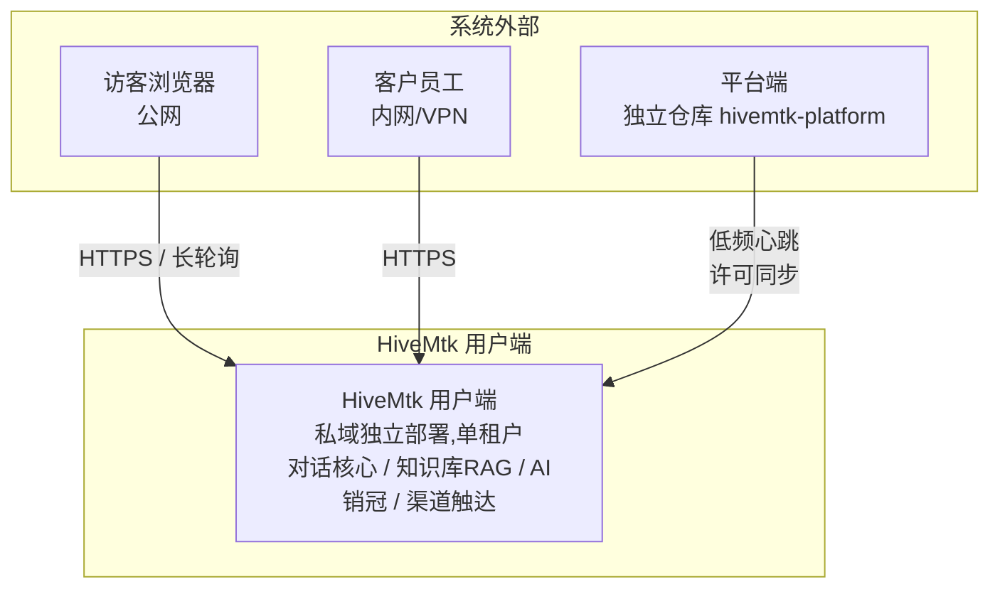
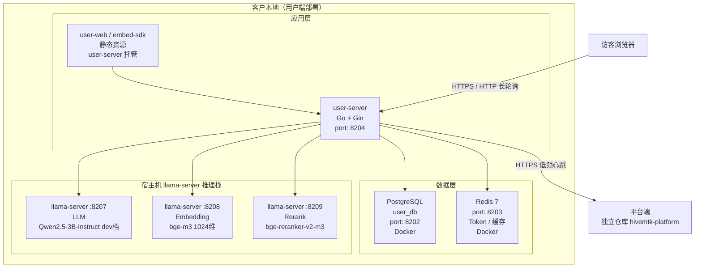
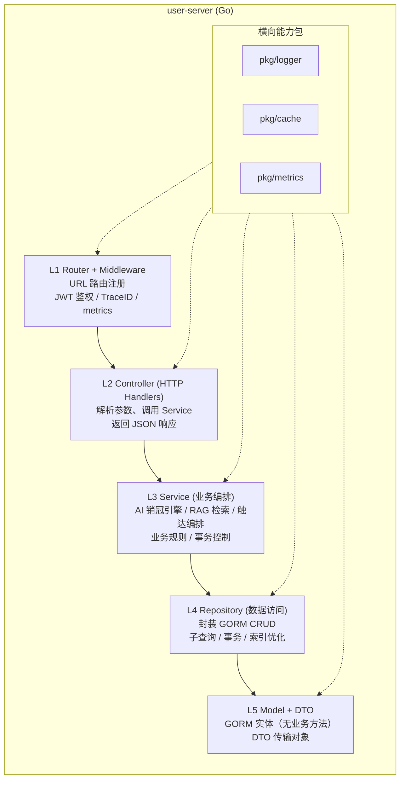
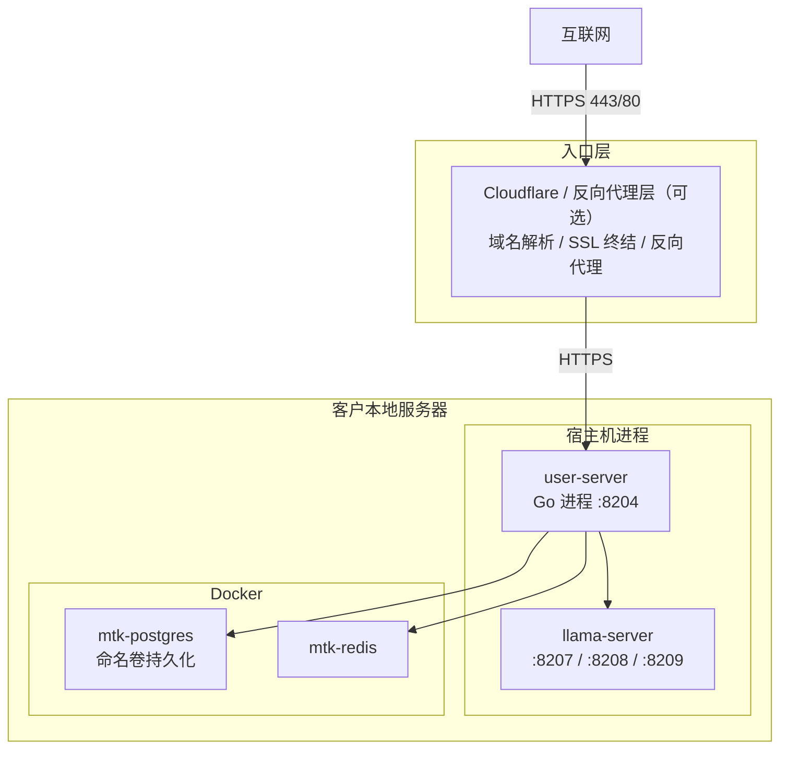
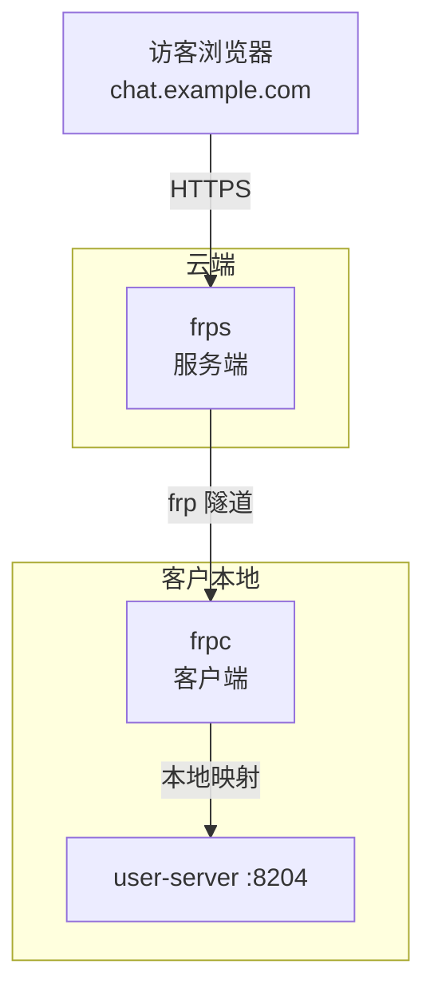

# HiveMtk 系统级架构图（C4 Model）

> **版本**：v1.0（2026-08-16）
> **方法论**：C4 Model（Context / Container / Component / Deployment）
> **范围**：HiveMtk 用户端（user-server + user-web + 推理栈）

---

## 一、Context（系统上下文）



**边界声明**：

| 角色 | 边界 | 说明 |
|------|------|------|
| **访客** | 系统外 | 通过企业官网嵌入 Chat Widget 接入 |
| **客户员工** | 系统外 | 通过浏览器访问 user-web 管理后台 |
| **平台端** | 系统外 | 独立仓库 `hivemtk-platform`，仅做许可/产品元数据同步 |
| **HiveMtk 用户端** | **本系统** | 单租户私域部署，无 `merchant_id` 字段 |

---

## 二、Container（容器视图）



### 2.1 关键端口

| 端口 | 容器/进程 | 协议 | 说明 |
|------|-----------|------|------|
| 8202 | mtk-postgres (Docker) | TCP | 用户端数据库 |
| 8203 | mtk-redis (Docker) | TCP | 用户端缓存 |
| 8204 | user-server (宿主机) | HTTP | 对话核心 API + 长轮询 |
| 8207 | llama-server (宿主机) | HTTP | LLM 推理 (OpenAI 兼容) |
| 8208 | llama-server (宿主机) | HTTP | Embedding (1024 维) |
| 8209 | llama-server (宿主机) | HTTP | Rerank |

> **铁律**：user-server 依赖宿主机 llama.cpp 提供推理，先启动 llama-server 再起 user-server。

### 2.2 容器/进程技术选型

| 组件 | 选型 | 理由 |
|------|------|------|
| user-server | Go 1.25 + Gin + GORM | 高性能、静态编译、运维简单 |
| user-web | Vue 3 + Vite + Element Plus | 现代前端栈、构建快 |
| PostgreSQL | pgvector 官方镜像 | 1024 维向量原生支持 |
| Redis | redis:7-alpine | 轻量、Token 存储 |
| 推理栈 | llama.cpp (宿主机进程) | OpenAI 兼容协议、统一二进制 |

---

## 三、Component（组件视图）

user-server 内部组件（五层架构）：



**详细规范**：参见 [GO_FIVE_LAYER_ARCHITECTURE.md](GO_FIVE_LAYER_ARCHITECTURE.md)

---

## 四、Deployment（部署视图）

### 4.1 私域部署标准模式



### 4.2 FRP 穿透模式（NAT 内网）



详见 [FRP私域部署指南.md](FRP私域部署指南.md)

### 4.3 启动顺序

```bash
# 1. 启动推理栈（创建 mtk-inference-net 网络）
make inference-up

# 2. 启动用户端（接入 mtk-inference-net 外部网络）
make user-up

# 3. 验证
curl http://localhost:8204/health
```

**禁止反过来启动**：user-server 依赖宿主机 llama-server 提供 Embedding/Rerank/LLM 推理能力，先起 user-server 会导致 RAG 不可用。

---

## 五、关键规则（命名铁律）

1. **平台层统一称「智能体」(AIAgent)**：禁止在文档/UI/代码注释中混用「AI 客服 / AI 销售」
2. **命名禁用清单**：禁止「机器人/助手」等称呼智能体
3. **`AIAgent.AgentType`**（sales / customer_service / hybrid）仅作内部子类型
4. **embedding 私域部署强制本地**：使用 llama.cpp + BAAI/bge-m3，维度 1024；禁止静默降级到云端 LLM 厂商 / hash 伪向量
5. **实时通道**：HTTP 长轮询（`/api/v1/ai/chat/poll`），WebSocket 已弃用

---

## 六、修订历史

| 版本 | 日期 | 修订人 | 内容 |
|------|------|--------|------|
| v1.0 | 2026-08-16 | @architects | 初版 C4 架构图（合并散落图表） |
