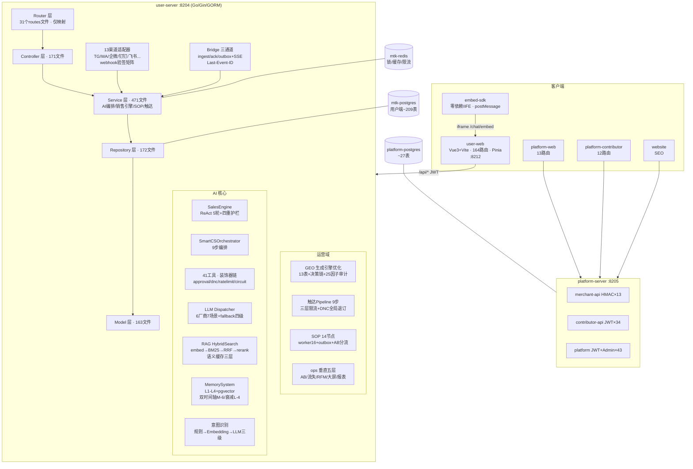

# HiveMtk 全功能清单与架构图（R39 · 六步流程 Step1）

> 生成: 2026-08-29 · 方法: 源码grep核实 + 运行时curl验证(8204)
> 基线: MASTER_FEATURE_INVENTORY(M1-M19) + feature_checklist(A1-A21/B1-B6) + 38轮cycle_state
> 状态: ✅已实现 ✅R39本轮实现 🔲缺口(断链) ❌论证砍掉

## 一、系统架构图

## 二、功能清单（20域）

| # | 域 | 核心能力 | 状态 |
|---|-----|---------|------|
| A1 | 认证会话 | JWT双token/MFA/OIDC/SSO/logout/防爆破/异常登录检测 | ✅ |
| A2 | CDP | OneID/13渠道身份/customer360/旅程10阶段/标签/分段/RFM | ✅ |
| A3 | 知识库RAG | KB CRUD/绑定/Hybrid检索/语义缓存/级联删除/contextual | ✅ R39补工作台接口 |
| A4 | AI Agent | ReAct/41工具/审批门/DNC/成本护栏/意图三级/反馈闭环 | ✅ |
| A5 | SOP工作流 | 14节点/entry_policy/max_wait/AB分流/SAGA/outbox死信 | ✅ |
| A6 | 全渠道接入 | 13渠道/webhook验签矩阵/ALLOW_INSECURE守卫/WA tier | ✅ |
| A7 | 消息中心 | 幂等三闸门/echo拦截/WS/SSE/Last-Event-ID | ✅ |
| A8 | 触达营销 | 9步pipeline/三层限流/quiet hours/transactional豁免/合规日志 | ✅ |
| A9 | 短链活码 | https强校验/活码轮转/域名池 | ✅ R39补links接口 |
| A10 | 邮件营销 | SMTP加密/追踪/退订/夜间守卫 | ✅ R39补送达分析 |
| A11 | 短信营销 | 三云厂商/夜间禁发/退订同步DNC | ✅ |
| A12 | 名片矩阵 | 5平台卡片/短链/统计 | ✅ |
| A13 | 内容创作 | content垂直五层/素材/脚本 | ✅ |
| A14 | GEO | 决策链/探针/SOV/25因子审计/爬虫监控/llms.txt | ✅ |
| A15 | 数据分析 | 自定义报表CSV/大屏/流失/AB/cohort | ✅ R39补AB高级统计 |
| A16 | 线索挖掘 | 群聊挖掘/评分/复活信号 | ✅ |
| A17 | 资产市场 | 资产包CRUD/Weave/热插拔/平台对接HMAC | ✅ |
| A18 | 系统管理 | 用户/角色/审计/备份/监控 | ✅ R39补security/flags/操作日志 |
| A19 | 实时通信 | chat_ws/visitor WS fail-closed/坐席 | ✅ |
| A20 | 嵌入SDK | origin白名单/postMessage协议 | ✅ |
| A21 | 话术库 | 异议6类/status_quo/Acknowledge/归因闭环 | ✅ R39补版本+AB曝光 |

## 三、R39 缺口清单（运行时404实证 + 决策矩阵尾项）

| # | 缺口 | 用户可达入口 | 论证结论 |
|---|------|------------|---------|
| G1 | 话术 semver/版本 + AB曝光日志 | 话术库管理页 | T-6/T-7 决策矩阵最后2项, 业界Langfuse/Gong证实 |
| G2 | feature-flags 11接口 | /system/featureFlags页 | Unleash/GrowthBook业界标配 |
| G3 | security 7接口 | /security页 | authentik/Vaultwarden标配 |
| G4 | backup stats/strategy/preview/restore | /system/backup页 | 管理必备 |
| G5 | ab-experiments 高级统计6接口 | /abExperiment页 | GrowthBook标配 |
| G6 | bots 6接口 | /bots页 | 渠道机器人管理 |
| G7 | kb-templates 6接口 | KB模板页 | Dify模板市场标配 |
| G8 | dashboard-templates 5接口 | 大屏模板页 | 报表复用 |
| G9 | rag/eval 5接口 | RAG评测页 | RAGAS/Langfuse标配 |
| G10 | links 4接口 | 短链页 | 前端调/api/links |
| G11 | quick-reply 2接口 | 客服快捷回复 | 客服工作台标配 |
| G12 | analytics cohort/path 2接口 | 分析页 | 用户分群留存 |
| G13 | customer-service 2接口 | 客服状态板 | 坐席管理 |
| G14 | email 送达分析4接口 | 邮件页 | Listmonk/BillionMail标配 |
| G15 | whatsapp bulk-send 2接口 | WA群发页 | 批量触达 |
| G16 | 零散18接口 | 各页 | mentions/cards/customer-events/marketing-flows/admin-tuning/customer-sessions/clues/message-hub-dlq/knowledge-presets等 |

> 详见 TASKS_R39.md (Step3/4 产出)
