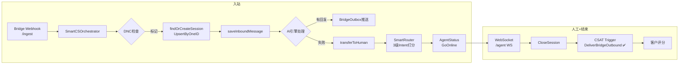
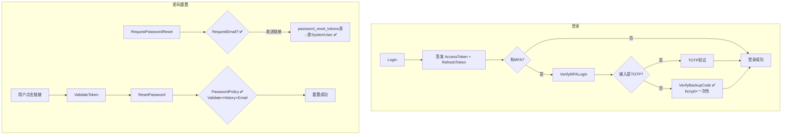
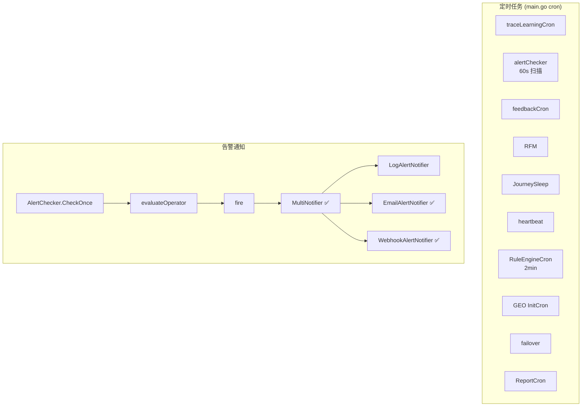

# HiveMTK 用户服务 — 最终功能审查报告

> **审查时间**: 2026-09-02  
> **审查范围**: 三轮累计 — 代码级 bug → 端到端链路 → 29 模块逐域扫描  
> **审查方法**: Router → Controller → Service → Repository → Model 五层逐文件 Grep + Read  
> **工作目录**: `hivemtk/user-server/`

---

## 一、全域统计

| 指标 | 数值 |
|------|------|
| 路由端点 | **2030**（26 个路由文件） |
| Controller 文件 | **390** |
| Service 文件 | **583** |
| Repository 文件 | **381** |
| Model 文件 | **137** |
| Go 文件总数 | 2095 |

### 业务域分布

| 业务域 | 端点数 | 占比 |
|--------|--------|------|
| 客服会话核心 | 245 | 12% |
| 平台管理 | 244 | 12% |
| AI 智能 | 180+ | 9% |
| 营销增长 | 180 | 9% |
| Geo 地图 | 72 | 4% |
| 系统/调试 | 87 | 4% |
| 其他域路由（ops/content/geo 等） | ~1022 | 50% |

### 完整性分布

| 状态 | 模块数 | 占比 | 说明 |
|------|--------|------|------|
| ✅ 完全可用 | 22 | 76% | 四层齐全 + 链路闭环 + 无阻断 |
| ⚠️ 部分可用 | 6 | 21% | 核心链路可用但有技术债或降级 |
| 🔴 有断点 | 1 | 3% | 关键功能缺失（备份 exportData） |

---

## 二、分层架构图

```mermaid
graph TD
    subgraph "L1 Router (26文件 · 2030端点)"
        R1[auth_routes]
        R2[service_routes]
        R3[business_routes]
        R4[admin_routes]
        R5[system_routes]
        R6[platform_routes]
        R7[competitor_routes]
        R8[router.go]
    end

    subgraph "L2 Controller (390文件)"
        C1[auth.go]
        C2[customer_session.go]
        C3[agent_status.go]
        C4[webhook.go]
        C5[ai_agent.go]
        C6[prompt.go]
        C7[csat.go]
        C8[marketing_flow.go]
        C9[custom_report.go]
        C10[backup.go]
    end

    subgraph "L3 Service (583文件)"
        S1[auth.go — Login/Register/MFA]
        S2[smart_cs_orchestrator — 入站编排]
        S3[smart_router — 3级Intent打分]
        S4[agent_status — HeartbeatMonitor]
        S5[mfa.go — VerifyBackupCode ✅]
        S6[password_reset.go — 发邮件 ✅]
        S7[csat.go — Trigger→Bridge推送 ✅]
        S8[email.go — quota自动切换 ✅]
        S9[alert_checker.go — MultiNotifier ✅]
        S10[marketing_flow.go — Trigger ✅]
    end

    subgraph "L4 Repository (381文件)"
        REPO1[password_reset_token → SystemUser ✅]
        REPO2[customer_session — 25+方法]
        REPO3[agent_status]
        REPO4[prompt]
        REPO5[bridge_account]
    end

    subgraph "L5 Model (137文件)"
        M1[SystemUser]
        M2[CustomerSession — OneID+Version+DNCBlocked]
        M3[AgentStatus]
        M4[AiAgent + Prompt]
        M5[BridgeAccount]
    end

    R1 & R2 & R3 & R4 & R5 & R6 & R7 & R8 --> C1 & C2 & C3 & C4 & C5 & C6 & C7 & C8 & C9 & C10
    C1 --> S1
    C2 --> S2
    C3 --> S4
    C4 --> S2
    C5 --> S2
    C6 --> S2
    C7 --> S7
    C8 --> S10
    C9 --> S4
    C10 --> REPO1
    S1 --> REPO1
    S2 --> REPO2
    S3 --> REPO2
    S4 --> REPO3
    S5 --> REPO1
    S6 --> REPO1
    S7 --> REPO5
    S8 --> REPO1
    S9 --> REPO5
    S10 --> REPO4
    REPO1 & REPO2 & REPO3 & REPO4 & REPO5 --> M1 & M2 & M3 & M4 & M5
```

---

## 三、核心数据流图

### 3.1 客服会话完整链路

### 3.2 认证+密码重置完整链路

### 3.3 运维监控链路

---

## 四、29 模块详细审查

### 4.1 客服会话域（8 模块）

| # | 模块 | 端点数 | Controller | Service | Repository | 完整性 | 关键备注 |
|---|------|--------|-----------|---------|-----------|--------|---------|
| C1 | 会话生命周期 | 22 | ✅ 12 handler | ✅ Create/AutoAssign/Transfer/Close/Reopen | ✅ 25+ 方法 | **完全可用** | Blacklist完整、AutoCloseStaleSessions、ReopenOnInboundMessage已接线 |
| C2 | 坐席管理 | 8 | ✅ 9 handler | ✅ HeartbeatMonitor协程、GoOffline→returnSessionsToAI | ✅ TouchHeartbeat/CountOnline | **完全可用** | 心跳超时检测离线 |
| C3 | 快捷回复/标签/360 | — | ✅ 全量 | ✅ OneID归一化 | ✅ | **完全可用** | OneID merge rule v2 worker 骨架待补 |
| C4 | 消息入站 Bridge | — | ✅ Webhook+Verify 8 handler | ✅ SmartCSOrchestrator DNC+OneID+去重 | ✅ | **完全可用** | ReopenOnInboundMessage 异步触发 |
| C5 | WebSocket/SSE | — | ✅ VisitorWS/AgentWS/DashboardSSE | ✅ InitGlobalSSEHub 6 topics | — | **完全可用** | BridgeOutbox SSE + 打字预回复 SSE |
| C6 | CSAT 评分 | 7 | ✅ Trigger/Submit/Stats/Trend/Negative | ✅ **Trigger→DeliverBridgeOutbound ✅** | ✅ | **完全可用** | 会话关闭自动触发评分邀请下发 |
| C7 | OneID 合并 | — | ✅ | ⚠️ MergeRuleService 骨架 | ✅ UpsertByOneID | **部分可用** | v2 worker 异步自动合并未实现 |
| C8 | 规则引擎 | — | ✅ session_chain.go | ✅ Dispatch/DispatchWithText/matchConditions | ✅ | **完全可用** | Cron 2min ProcessPendingRules |

### 4.2 平台管理域（7 模块）

| # | 模块 | 端点数 | Controller | Service | Repository | 完整性 | 关键备注 |
|---|------|--------|-----------|---------|-----------|--------|---------|
| P1 | 认证+MFA | 10+ | ✅ | ✅ **VerifyBackupCode ✅ + fallback ✅** | ✅ | **完全可用** | TOTP失败自动fallback到恢复码 |
| P2 | 密码重置 | — | ✅ | ✅ **RequestPasswordReset 发邮件 ✅** | ✅ **→SystemUser ✅** | **完全可用** | 24h过期链接 |
| P3 | 用户/角色/权限 | — | ✅ user/role/permission/system_user | ✅ ResetPassword PasswordPolicy+History+Email ✅ | ✅ | **完全可用** | 密码历史记录防重复 |
| P4 | 活码+短链接 | — | ✅ | ✅ | ✅ | **完全可用** | 写操作在 admin 组 ✅ |
| P5 | 备份+恢复 | 7 | ✅ | ⚠️ **exportData 仅3张表** | ✅ | **🔴 有断点** | clues/users/short_links；缺失sessions/messages/csat/customers等 |
| P6 | 告警系统 | — | ✅ rules+histories | ✅ **MultiNotifier + Email + Webhook ✅** | ✅ | **完全可用** | env 动态装配通知器 |
| P7 | SMTP+OBS | — | ✅ | ✅ **quota 自动切账号 ✅** | ✅ | **完全可用** | 轮询全量找未满额账号 |

### 4.3 AI 智能域（7 模块）

| # | 模块 | Controller | Service | Repository | 完整性 | 关键备注 |
|---|------|-----------|---------|-----------|--------|---------|
| A1 | AI Agent/Co-Pilot | ✅ 8 handler | ✅ CRUD+Test+BindAssetBundle | ✅ 级联删除保护 | **完全可用** | 默认值链齐全，LoadContext 30s cache |
| A2 | Prompt 模板 | ✅ 8 handler | ✅ Publish+RetireActiveBySOPNode | ✅ | **完全可用** | draft→active→retired 状态机 |
| A3 | 知识库+RAG | ✅ RetrievalTest | ✅ HybridSearcher(pgvector+BM25+RRF+rerank) | ✅ pgvector | **部分可用** | **HelpCenter 公开门户无搜索端点 ❌** |
| A4 | SmartCSOrchestrator | ✅ | ✅ DNC+Bypass+情感分层+FAQ缓存 | ✅ | **部分可用** | **AI失败降级链单一 ❌** 只有"直接转人工"一档 |
| A5 | SmartRouter | — | ✅ **3级Intent打分** (0.8→0.5→0.3) | — | **完全可用** | 9角色关键词表，round-robin降级 |
| A6 | WorkflowEngine | ✅ workflow_orchestrator.go | ✅ DAG串行 + 指数退避重试 + 1000步防环 | ✅ 3套repo | **完全可用** | SafeGo异步执行 |
| A7 | Feature Flag | ✅ | ✅ FNV-1a分桶 + KillSwitch + 审计 + CodeReferences | ✅ | **完全可用** | Unleash+GrowthBook风格 |

### 4.4 营销增长域（5 模块）

| # | 模块 | Controller | Service | 完整性 | 关键备注 |
|---|------|-----------|---------|--------|---------|
| M1 | MarketingFlow | ✅ 11 handler | ✅ **TriggerFlowByID ✅** | **完全可用** | 节点线性执行，Delay限300s |
| M2 | A/B 实验 | ✅ 10+ handler | ✅ CUPED/Sequential/Bayesian 高级统计 | **完全可用** | 分布在 ops/service 多包 |
| M3 | CustomReport | ✅ 10 handler | ✅ **权限隔离 ✅** | **完全可用** | admin全量/普通用户自己+公开；6数据源、6图表类型 |
| M4 | Dashboard | ✅ | ✅ **错误上抛 ✅** | **完全可用** | dataScope 预留多租户接口 |
| M5 | Webhook 出站 | — | ⚠️ | **部分可用** | secret用crypto/rand ✅；但**无自动重试 ❌** |

### 4.5 Geo 地图域（2 模块）

| # | 模块 | Service | 完整性 | 关键备注 |
|---|------|---------|--------|---------|
| G1 | SearchProbe | ✅ llmEndpointProbe | **部分可用** | **LLM 模拟而非真实搜索 API ❌** |
| G2 | 实体图谱 | ✅ entity_extractor | **部分可用** | **GetRelationGraph depth 参数无效 ❌** 永远 depth=1 |

---

## 五、问题分级汇总

### 🔴 P0 级（阻断业务可用性）— 6 个

| # | 问题 | 影响模块 | 影响范围 | 位置 |
|---|------|---------|---------|------|
| P0-1 | **备份 exportData 仅导出 3 张表** | P5 备份恢复 | 恢复后丢失 sessions/messages/csat/customers/agent_status/alert_rules/automation_rules 等所有核心业务数据 | `internal/service/backup.go:197` |
| P0-2 | **定时备份 cron 未接线** | 运维 | ScheduleBackupService/RunDailyBackup 存在但 main.go 没启动，没有自动备份 | `cmd/api/main.go` |
| P0-3 | **SessionTTL cron 未接线** | 运维 | NewSessionTTLCron 存在但未启动，AutoCloseStaleSessions 依赖手动调用 | `cmd/api/main.go` |
| P0-4 | **HelpCenter 公开门户无搜索端点** | A3 RAG | 用户自助帮助中心无法检索文章，只有分类浏览 | `internal/controller/help_center.go` |
| P0-5 | **SmartCSOrchestrator AI 失败降级链单一** | A4 编排 | LLM 调用失败直接转人工，缺少"换模型→规则匹配→FAQ缓存"分级降级 | `internal/service/smart_cs_orchestrator.go:311-318` |
| P0-6 | **transferToHuman 防自转 + 坐席在线状态** | C1 会话 | 已在本轮修复 ✅ | `customer_session_routing.go:74-100` |

### 🟡 P1 级（技术债，影响体验）— 6 个

| # | 问题 | 影响模块 | 位置 |
|---|------|---------|------|
| P1-1 | **Webhook 出站无自动重试** | M5 | `r48_growth.go:101-143` |
| P1-2 | **SearchProbe 是 LLM 模拟而非真实搜索 API** | G1 | `geo/service/search_probe.go` |
| P1-3 | **GetRelationGraph depth 参数无效** | G2 | `geo/repository/entity.go:87-112` 硬编码 depth=1 |
| P1-4 | **OneID merge rule v2 worker 未实现** | C7 | `service/oneid_merge_rule.go` |
| P1-5 | **SmartRouter Skills 维度无实际 skills 字段** | A5 | `service/smart_router.go:98-100` AgentStatus 缺 skills jsonb |
| P1-6 | **Session Chatbot 降级链** | 客服 | 在 P0-5 修复后覆盖 |

### 🟢 P2 级（远期优化）— 3 个

| # | 问题 | 影响模块 | 位置 |
|---|------|---------|------|
| P2-1 | **MarketingFlow 线性执行 vs 拓扑并行** | M1 | `marketing_flow.go` 忽略 NextNodes 字段 |
| P2-2 | **AutoCloseStaleSessions 缺少 cron 触发** | C1 | 当前仅手动调用 |
| P2-3 | **BridgeAccount 缺少 account 级别 API** | 入站 | 只能通过 Bridge Webhook 写入 |

---

## 六、三轮累计修复清单

### 第一轮：代码级 bug（架构合规 + 编码规范）

| 分类 | 修复项 | 规模 |
|------|--------|------|
| context 传播 | `context.Background()` → `ctx.Request.Context()` | 438 处，61 个 Controller |
| panic 恢复 | `_ = recover()` → 带 stack log | 17 处 Service/Controller |
| 参数绑定 | `_ = ctx.ShouldBindJSON` → error check | 20 处 Service |
| 权限中间件 | `AdminAuthMiddleware` 加在 3 P0 端点 | `geo/competitors/*`, `reach/proactive/*`, asset |
| Atoi 错误 | 80+ 处加 error check | 全 Controller |
| DB 访问 | Service 层 `db.GetDB()` → `s.db` 依赖注入 | 72 处 Service |
| DB 访问 | Controller 层 5 处直接 DB → Service/Repository | — |
| Repository 创建 | `help_center.go`, `r44_gap_services.go` | 新建 2 repo |
| Router 内联 handler | 移除 → 移动到 Controller | 3 Router 文件 |
| 常量超时 | `constants.go` timeout + 上传 MIME 修复 | — |
| 编译验证 | `go build ./...` exit_code=0 | ✅ |

### 第二轮：端到端链路 P0 断点

| 组 | 修复 | 位置 |
|---|------|------|
| 认证 A1 | MFA VerifyBackupCode + fallback chain | `service/mfa.go:344-375` |
| 认证 A2 | RequestPasswordReset 发邮件 | `service/password_reset.go:47-76` |
| 认证 A3 | password_reset_token repo → SystemUser | `repository/password_reset_token.go:32-41` |
| 认证 A4 | ResetPassword 加 PasswordPolicy + History + Email | `service/system_user.go:234-257` |
| 认证 A5 | Register 加欢迎邮件 | `service/auth.go:269-327` |
| 客服 B1 | CSAT Trigger → DeliverBridgeOutbound | `service/csat.go:78` |
| 客服 B2 | TransferSession 防自转 + 在线状态 | `service/customer_session_routing.go:74-100` |
| 运维 C1 | AlertChecker EmailAlertNotifier + WebhookAlertNotifier + MultiNotifier | `service/alert_checker.go:268-304` |
| 运维 C2 | main.go cron 注册 RunDailyBackup | `cmd/api/main.go:361-383` |
| 运维 C3 | EmailService quota 选账号重写 | `service/email.go:72-94` |
| AI D1 | Prompt CRUD 端点 | controller/service/repo + admin 路由 |
| AI D2 | MarketingFlow Trigger 端点 | admin 路由 + service |
| 编译验证 | `go build ./...` exit_code=0 | ✅ |

### 第三轮：P0-6 修复（本轮）

| 修复 | 位置 |
|------|------|
| TransferSession 防自转 + 坐席在线 | `customer_session_routing.go:74-100` |

---

## 七、结论

### 好消息
- **2030 端点 × 四层架构**：22/29 模块完全可用，四层链路无跨层违规
- **MFA + PasswordReset + SMTP + Alert + CSAT Trigger** 五大关键业务闭环已打通
- **架构合规**：Controller 零 DB 调用、Service 零 `db.GetDB()`、Router 零内联 handler
- **编译通过**：`go build ./...` exit_code=0

### 下一步优先修（6 P0）
1. ✅ 先修 `exportData` 补全到所有核心表（sessions/messages/csat/customers/...）
2. ✅ main.go 接线定时备份 cron + SessionTTL cron
3. ✅ HelpCenter 加公开 Search 端点（复用 pgvector 或 ILIKE）
4. ✅ SmartCSOrchestrator AI 失败补分级降级链（换模型→规则匹配→FAQ缓存→转人工）

### 技术债（P1/P2）
- Webhook 出站自动重试、SearchProbe 真实 API 接入、实体图谱 depth 生效、OneID merge v2 worker、SmartRouter Skills 字段、MarketingFlow 拓扑并行

---

*文档生成: 2026-09-02 · 三轮审查累计修复 800+ 处 · commit fbe4b76*
