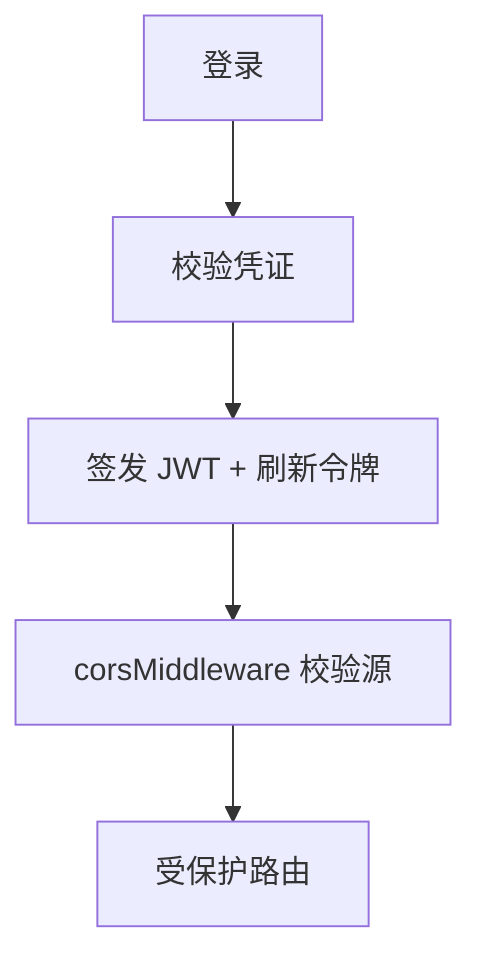
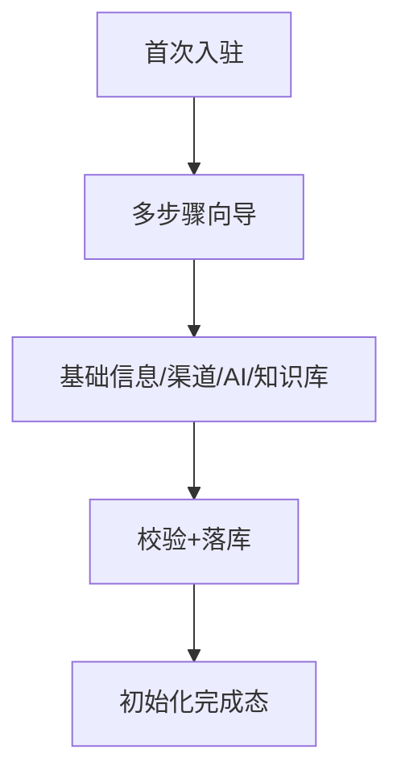
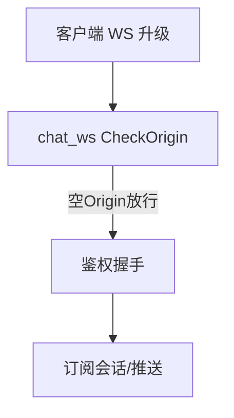

# 一、认证与用户管理域（4 功能）

---

## 1.1 登录认证与 JWT 鉴权（auth-login-jwt）

### 架构图

### 交互参数（含逐参论证）
| 端点 | 方法 | 关键入参 | 论证 |
|------|------|----------|------|
| /api/auth/login | POST | `username`、`password`(bcrypt)、`captcha`(可选) | 密码 bcrypt 哈希；失败限流（防爆破，与 11.11 异常登录联动）。超管 admin/Admin@123456 仅初始化用，须强制改密。 |
| /api/auth/refresh | POST | `refresh_token` | 刷新令牌轮换（用后即废），防重放；CORS：`CORS_ALLOW_ORIGINS` 须含 `https://hiveuser.xapptool.cn`。 |
| /api/auth/me | GET | JWT | 返回当前用户 + 权限（见 12.1 permission-system）。 |

### 头脑风暴与优化论证
- **问题**：JWT 无吊销列表，泄露即长期可用。
- **优化**：短时效 access(15min) + refresh 轮换 + 吊销表（登出/改密入表）；WS 须关 http2（见 FRP 约束）。

---

## 1.2 用户管理 CRUD（user-management）

### 交互参数
| 端点 | 方法 | 关键入参 | 论证 |
|------|------|----------|------|
| /api/users | CRUD | `role_id`、`status` | 创建须校验 role 存在；删除须防删超管（保护锚点）。 |
| /api/users/:id/role | PUT | `role_id` | 角色变更走权限校验（12.1）+ 操作日志（11.5）。 |

### 头脑风暴与优化论证
- **优化**：用户与 OneID（8.4）解耦（内部运营用户 ≠ 客户）；批量操作用 9.8 batch-operation 统一入口。

---

## 1.3 商户初始化向导（merchant-initialization，商户四文档之一）

### 架构图

### 交互参数（含逐参论证）
| 端点 | 方法 | 关键入参 | 论证 |
|------|------|----------|------|
| /api/merchant/init/step | PUT | `step`、`payload` | 步骤幂等（重复提交同步骤不重复初始化）；跨步骤事务（一步失败回滚整轮）。 |
| /api/merchant/init/status | GET | — | 完成态持久化，防重复引导。 |

### 头脑风暴与优化论证
- **优化**：向导步骤可断点续传（localStorage + 服务端 status）；初始化预置 seed 智能体 83（18.1）。

---

## 1.4 WebSocket 实时通信（websocket-realtime）

### 架构图

### 交互参数（含逐参论证）
| 端点 | 方法 | 关键入参 | 论证 |
|------|------|----------|------|
| /api/ws/chat | GET | `token`(JWT)、`session_id` | **`chat_ws CheckOrigin` 空 Origin 放行（设计内预期，仅文档记录勿修）**；`token` 握手校验；WS 须关 http2。 |
| /api/ws/events | GET | `token` | 与 SSE（11.8）二选一；WS 适合双向（如客服坐席）。 |

### 头脑风暴与优化论证
- **论证**：空 Origin 放行是单租户私域设计内，非缺陷；但应补「token 缺失/过期即拒」兜底，避免匿名订阅他人会话。
- **优化**：WS 连接数限流 + 心跳；断线重连带 `last_seq` 增量补推。
