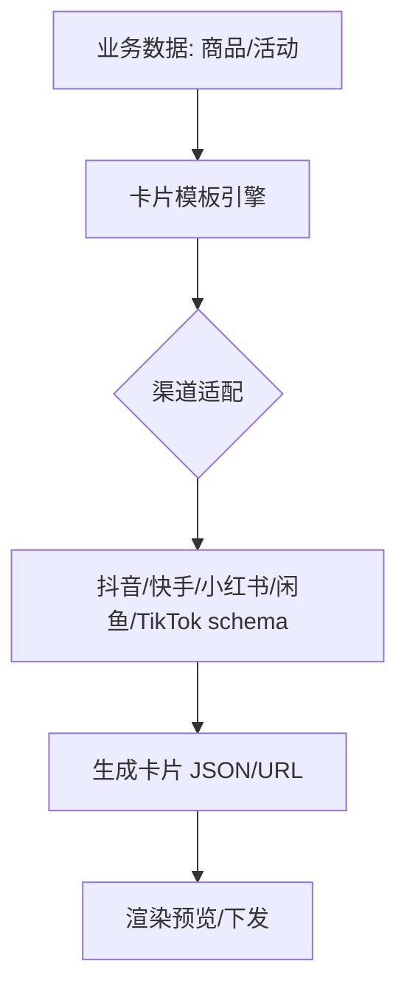

# 二、多平台卡片域（5 功能）

> 抖音/快手/小红书/闲鱼/TikTok 卡片生成。结构同构，差异在渠道协议与卡片 schema。

---

## 2.0 通用架构图

---

## 2.1 抖音卡片（card-douyin）
| 端点 | 方法 | 关键入参 | 论证 |
|------|------|----------|------|
| /api/cards/douyin | POST | `title`、`price`、`img_urls[]`、`jump_url` | `img_urls` 数量/尺寸须符合抖音规范；`jump_url` 须备案域名（合规）。 |

## 2.2 快手卡片（card-kuaishou）
| 端点 | 方法 | 关键入参 | 论证 |
|------|------|----------|------|
| /api/cards/kuaishou | POST | `title`、`media`、`action` | 同 2.1；渠道 schema 字段命名差异（media vs img_urls）须适配层归一。 |

## 2.3 小红书卡片（card-xiaohongshu）
| 端点 | 方法 | 关键入参 | 论证 |
|------|------|----------|------|
| /api/cards/xiaohongshu | POST | `note_title`、`cover`、`tags[]` | 白名单 `xiaohongshu`（非 `xhs`，见桥接白名单约束）；`tags` 限长防超。 |

## 2.4 闲鱼卡片（card-xianyu）
| 端点 | 方法 | 关键入参 | 论证 |
|------|------|----------|------|
| /api/cards/xianyu | POST | `item_title`、`price`、`desc` | 二手场景，价格区间校验；与 3.3 闲鱼自动回复账号体系联动。 |

## 2.5 TikTok 卡片（card-tiktok）
| 端点 | 方法 | 关键入参 | 论证 |
|------|------|----------|------|
| /api/cards/tiktok | POST | `title`、`media`、`locale` | 多语言 `locale` 必填（出海场景）；与 3.4 TikTok 自动回复联动。 |

---

## 头脑风暴与优化论证（全域）
- **问题**：5 套卡片逻辑重复，渠道规范变更需改 5 处，易漂移。
- **优化**：抽 `CardGenerator` 接口 + 渠道适配器（抖音/快手/小红书/闲鱼/TikTok 各实现 `Build()`）；模板与 schema 配置化（YAML），新增渠道零代码。
- **论证**：适配器模式降维护成本；配置化使运营可自助调卡片样式。
- **风险**：各渠道规范频繁变动，需适配器单测覆盖字段校验边界（尺寸/数量/字符集）。
