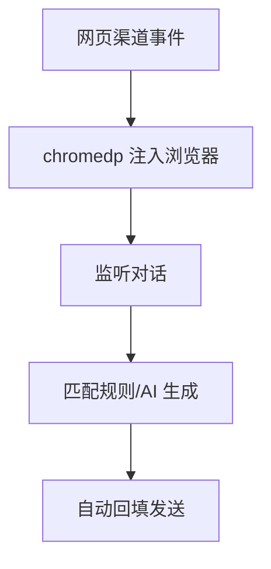
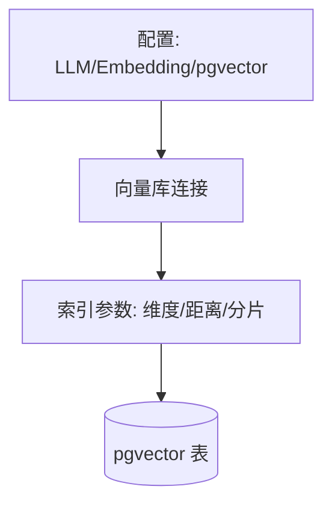
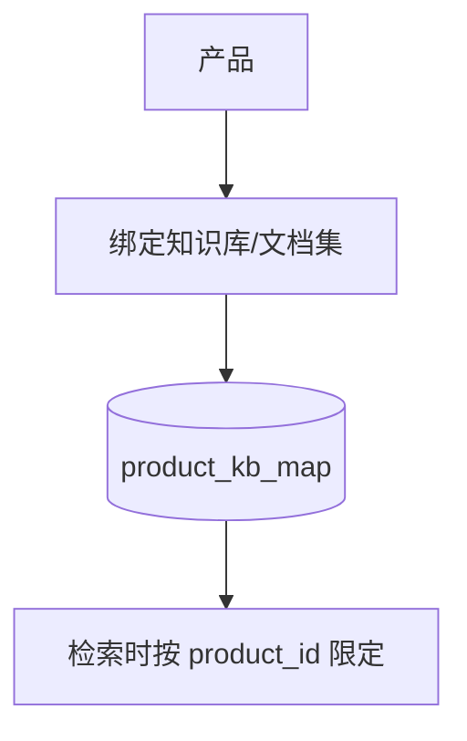
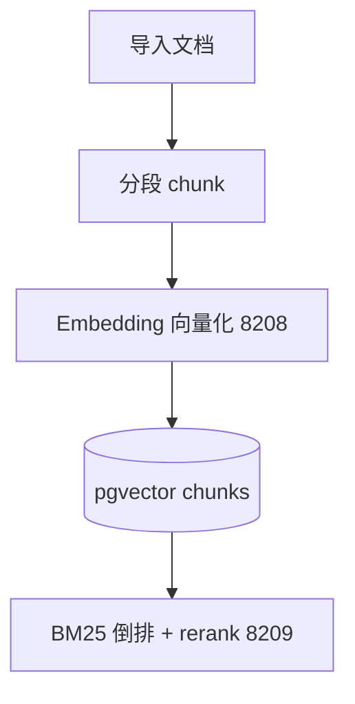
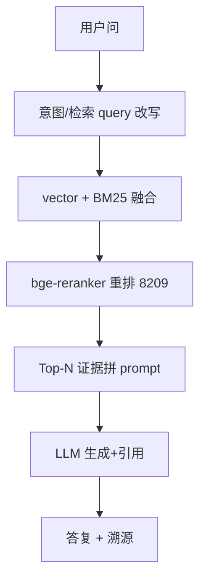
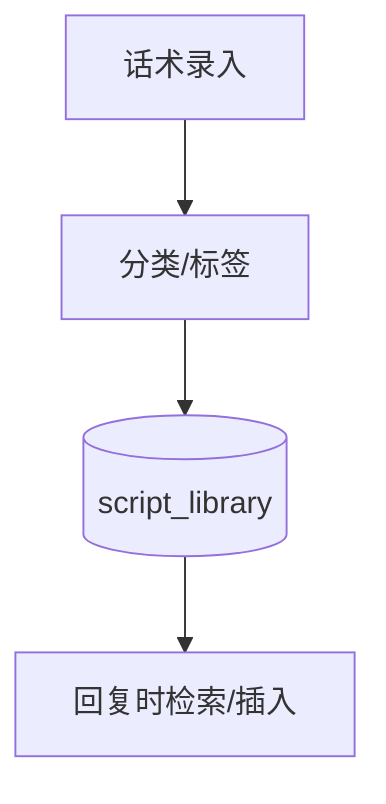

# 三、自动回复与 RAG 域（8 功能）

> RAG 三文档边界：`rag-knowledge-base`(配置) → `knowledge-management`(内容入库) → `agent-rag-qa`(应用调用)。三级检索：vector + BM25 + bge-reranker。

---

## 3.1 通用自动回复（auto-reply-universal，chromedp）

### 架构图

### 交互参数（含逐参论证）
| 端点 | 方法 | 关键入参 | 论证 |
|------|------|----------|------|
| /api/auto-reply/rules | CRUD | `match`(关键词/正则)、`reply`、`channel` | `match` 正则须限复杂度（防 ReDoS 灾难性回溯）；`channel` 单值。 |
| /api/auto-reply/toggle | POST | `enabled`、`scope` | 开关默认关闭（架构约束：严禁无开关默认开启的内容审核/自动化）；scope 限定账号避免全量误开。 |

### 头脑风暴与优化论证
- **问题**：chromedp 依赖真实浏览器会话，账号掉线即失效，无统一重连治理。
- **优化**：会话健康探活 + 掉线自动重登（与 platform-account 健康度联动）；规则与 AI 混合（命中规则走规则，未命中走 RAG），降 LLM 成本。

---

## 3.2 / 3.3 / 3.4 闲鱼 / TikTok / 小红书 自动回复

> 三者与 3.1 同构，差异在渠道适配层与账号体系（见 platform-account）。统一论证：
- **参数**：`/api/auto-reply/{channel}/rules`，`channel` 取值 `xianyu/tiktok/xiaohongshu`（白名单，非 `xhs`）。
- **优化**：抽公共 `AutoReplyEngine`，渠道差异仅适配器；避免三套重复逻辑漂移。

---

## 3.5 RAG 知识库配置（rag-knowledge-base）

### 架构图

### 交互参数（含逐参论证）
| 端点 | 方法 | 关键入参 | 论证 |
|------|------|----------|------|
| /api/rag/kb | CRUD | `embedding_model`(bge-m3)、`dim`、`distance`(cosine)、`chunk_size` | `dim` 必须与 Embedding 模型输出维度一致，否则入库即错配（检索 0 召回）；配置变更须灰度（重建索引）。 |
| /api/rag/kb/test | POST | `kb_id` | 连通性探测（Embedding 8208 / Rerank 8209 可达性），不可达降级返回空（asset_market 同类处理）。 |

### 头脑风暴与优化论证
- **问题**：`similarity_threshold=0` 时 vector 总返回 top-K（与相关性无关），"total>0" 不能判召回（见测试坑）。
- **优化**：召回判定须校验返回 chunk 的 `content` 是否含目标唯一词才是真召回证据；阈值默认设为 >0 且分产品可调。

---

## 3.6 RAG 产品配置（rag-product-config，多产品绑定）

### 架构图

### 交互参数（含逐参论证）
| 端点 | 方法 | 关键入参 | 论证 |
|------|------|----------|------|
| /api/rag/product-config | CRUD | `product_id`、`kb_ids[]` | **关键**：知识导入产品存在性检查**不走 `products` 表**（库中不存在），走别实现；token 限定到不存在的产品→404；限定产品去导别的产品→403(IDOR)。 |
| /api/rag/product-config/bind | POST | `product_id`、`doc_id` | 绑定须校验产品存在性，否则 404；越权绑定他人产品 403。 |

### 头脑风暴与优化论证
- **问题**：产品存在性检查与导入权限分散，易出 404/403 语义混乱。
- **优化**：统一 `ProductResolver`（先查存在性再查归属），集中返回 404/403，避免散落各 handler 重复实现。

---

## 3.7 知识库文档管理（knowledge-management，内容入库）

### 架构图

### 交互参数（含逐参论证）
| 端点 | 方法 | 关键入参 | 论证 |
|------|------|----------|------|
| /api/knowledge/docs/import | POST | `kb_id`、`file_url`、`product_id`(可选) | `product_id` 可选（node_abnormal：rag.search 在 `product_id=''` 搜全量）；大文件异步导入 + 进度查询（防超时）。 |
| /api/knowledge/docs/:id/chunks | GET | `doc_id`、`page` | 分段可回看；chunk 大小须与 3.5 `chunk_size` 一致。 |
| /api/knowledge/reindex | POST | `kb_id` | 重建索引须在线（双缓冲：新索引建完再切换），禁停服。 |

### 头脑风暴与优化论证
- **问题**：导入同步执行，大文档阻塞请求；reindex 停服。
- **优化**：导入改异步任务队列 + 进度；reindex 双缓冲零停机；失败 chunk 记录 `failed_chunk` 可重试。

---

## 3.8 RAG 智能客服（agent-rag-qa，应用层）

### 架构图

### 交互参数（含逐参论证）
| 端点 | 方法 | 关键入参 | 论证 |
|------|------|----------|------|
| /api/rag/qa | POST | `question`、`product_id`(可选)、`top_n`(默认5)、`with_citation` | `top_n` 上限约束（防上下文超限）；`with_citation` 返回 chunk 引用供溯源。 |
| /api/rag/qa/feedback | POST | `qa_id`、`helpful`(bool) | 反馈回流 `trace_learning` 四维度；`rag.search` 在 `product_id=''` 搜全量。 |

### 头脑风暴与优化论证
- **问题**：rag.search 异常（context canceled / tool execution timeout）被误判为代码缺陷。
- **论证（架构基线）**：这是**非代码缺陷的合法运行时失败**（根因=RAG 栈 embedding/rerank 过载或客户端断开）。证据：DB 有错误详情、TimeoutDecorator 返完整 ErrorResult、Retry/CircuitBreaker 判 cancel/deadline 不可重试不计熔断、rag.search 全程传播 ctx。运维建议查 RAG 栈容量/调专属超时/加降级，勿在工具层猜测改代码。

---

## 3.9 话术库（script-library）

### 架构图

### 交互参数（含逐参论证）
| 端点 | 方法 | 关键入参 | 论证 |
|------|------|----------|------|
| /api/scripts | CRUD | `category`、`content`、`variables` | 与 objection-handler 话术库区分：本库为通用话术，异议话术走 15.5。 |
| /api/scripts/search | GET | `keyword`、`category` | 检索须支持变量占位符替换后预览。 |

### 头脑风暴与优化论证
- **优化**：话术与 RAG 证据打通（高置信话术优先，低置信走 RAG），形成「话术→证据」两级应答。
