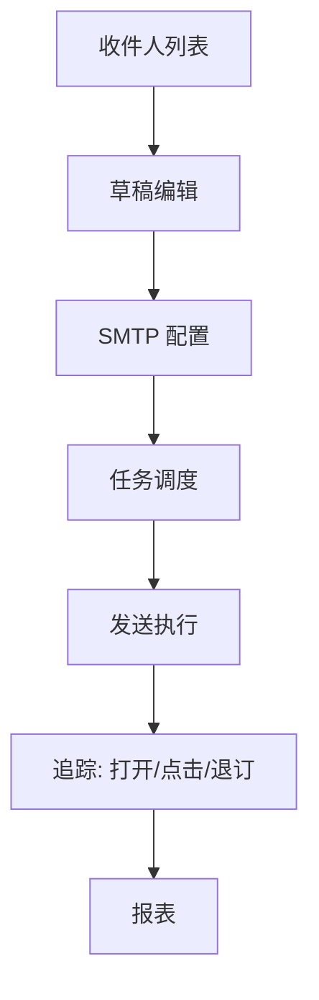

# 四、邮件营销域（7 功能）

---

## 4.1 邮件列表与收件人（email-list-management）
| 端点 | 方法 | 关键入参 | 论证 |
|------|------|----------|------|
| /api/email/lists | CRUD | `name`、`double_opt_in`(bool) | `double_opt_in` 默认 true（合规底线，防垃圾邮件）；导入须去重 + 格式校验。 |
| /api/email/lists/:id/subscribers | POST | `emails[]`、`status` | 批量导入分批（≤1000/批）；退订用户自动过滤（4.7）。 |

## 4.2 SMTP 配置（email-smtp-config）
| 端点 | 方法 | 关键入参 | 论证 |
|------|------|----------|------|
| /api/email/smtp | CRUD | `host`、`port`、`user`、`pass`(加密) | 密码加密；发送前连通性探测（发测试信）。多 SMTP 负载均衡/故障转移。 |

## 4.3 邮件草稿（email-draft-management）
| 端点 | 方法 | 关键入参 | 论证 |
|------|------|----------|------|
| /api/email/drafts | CRUD | `subject`、`html`、`variables` | 变量声明 + 发送前渲染校验（防未替换占位符发出）。 |

## 4.4 邮件任务（email-jobs-management）
| 端点 | 方法 | 关键入参 | 论证 |
|------|------|----------|------|
| /api/email/jobs | CRUD | `list_id`、`schedule`(cron)、`throttle`(QPS) | `throttle` 防被收件方限流/拉黑；cron 时区显式（商户时区）。 |

## 4.5 邮件发送执行（email-send-execution）
| 端点 | 方法 | 关键入参 | 论证 |
|------|------|----------|------|
| /api/email/send | POST | `job_id`/`draft_id`、`batch` | 发送幂等（同 job 重发不重复）；失败重试指数退避 + 死信。与 reach-pipeline(15.7) 控频一致。 |

## 4.6 邮件追踪（email-tracking，像素 + Webhook）
| 端点 | 方法 | 关键入参 | 论证 |
|------|------|----------|------|
| GET /api/email/track/open/:token | GET | `token`(签名) | 1x1 像素；`token` 防伪造（HMAC），打开事件入 CDP（8.3）。 |
| POST /api/email/webhook | POST | `provider_event` | Webhook 验签（厂商 secret）；事件幂等（同 message_id 不重复计）。 |

## 4.7 退订管理（email-unsubscribe）
| 端点 | 方法 | 关键入参 | 论证 |
|------|------|----------|------|
| GET/POST /api/email/unsubscribe | GET/POST | `token`/`email` | 一键退订 + 全局退订（影响所有列表）；退订即时生效（合规 GDPR 类）。 |

---

## 头脑风暴与优化论证（全域）
- **问题**：发送无全局频控，多任务并行易超 SMTP 限额被拉黑；追踪 token 易被代理/预览预取误记。
- **优化**：发送全局令牌桶（Redis，跨任务）；打开追踪加「二次确认」（去预取误报）；Webhook 事件统一幂等表。
- **论证**：全局频控是送达率护栏；幂等表防重复统计扭曲报表。
