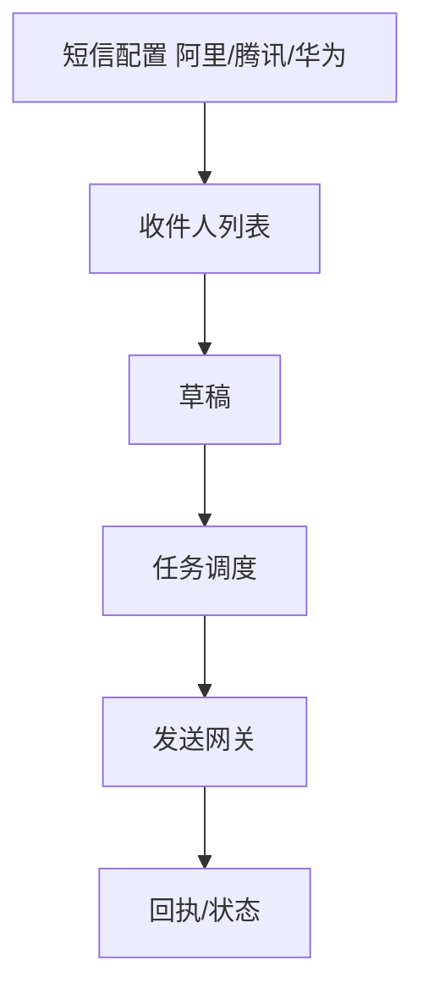

# 五、短信营销域（4 功能）

---

## 5.1 短信配置（sms-config，阿里云/腾讯云/华为云）
| 端点 | 方法 | 关键入参 | 论证 |
|------|------|----------|------|
| /api/sms/config | CRUD | `provider`、`ak/sk`(加密)、`sign`、`template_code` | 密钥加密；签名 `sign` 须实名报备；多厂商故障转移。 |

## 5.2 短信列表与发送（sms-list-management）
| 端点 | 方法 | 关键入参 | 论证 |
|------|------|----------|------|
| /api/sms/lists | CRUD | `phones[]` | 手机号格式校验（国内 11 位）；导入去重 + 黑/退订过滤。 |
| /api/sms/send | POST | `list_id`、`content` | `content` 长度计费分段校验（70/67 字）；敏感词前置过滤（合规）。 |

## 5.3 短信草稿（sms-draft-management）
| 端点 | 方法 | 关键入参 | 论证 |
|------|------|----------|------|
| /api/sms/drafts | CRUD | `content`、`variables` | 变量渲染校验（手机号/姓名占位）；长度预警。 |

## 5.4 短信任务调度（sms-jobs-management）
| 端点 | 方法 | 关键入参 | 论证 |
|------|------|----------|------|
| /api/sms/jobs | CRUD | `schedule`、`throttle` | 与邮件同构；夜间禁发（合规，22:00-8:00 默认禁发窗口）。 |

---

## 头脑风暴与优化论证（全域）
- **问题**：短信无夜间禁发护栏，易触合规红线；多厂商无统一回执归一。
- **优化**：调度内置合规禁发窗口（可配）；回执状态归一为 pending/sent/delivered/failed（对齐 message_hub 状态机），失败自动切换厂商。
- **论证**：合规禁发是法律底线；状态归一便于统一监控（与 14 域 message_hub 状态机一致）。
