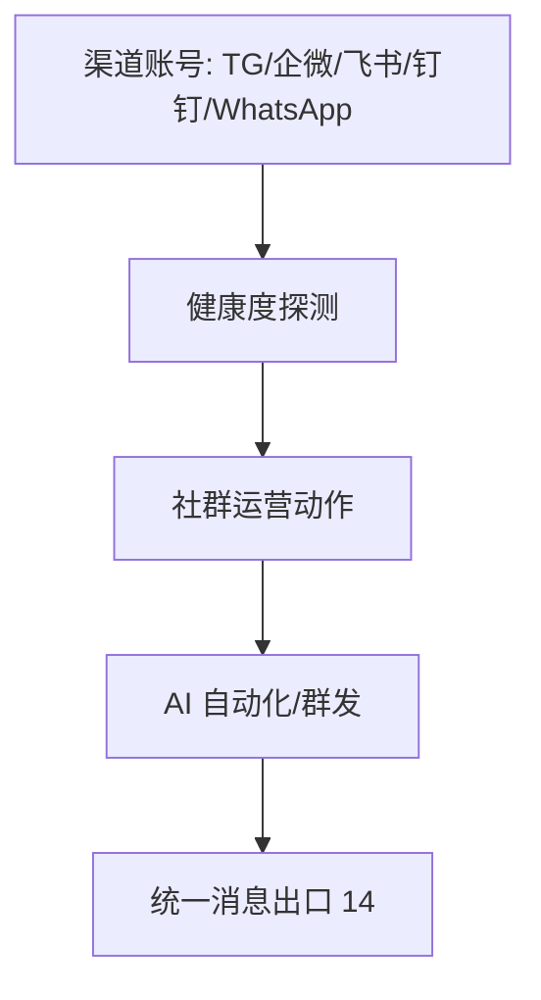

# 六、社群管理域（8 功能）



---

## 6.1 WhatsApp 营销（community-whatsapp）
| 端点 | 方法 | 关键入参 | 论证 |
|------|------|----------|------|
| /api/community/whatsapp/* | CRUD | `phone`、`template`(官方模板) | WhatsApp 须用审核模板（Meta 规范）；非模板消息限 24h 服务窗口。 |

## 6.2 Telegram AI 销售自动化（agent-telegram-automation）
### 架构图
```mermaid
flowchart TD
    A[ReconcileTelegramWebhooks] --> B[StopAllPolling]
    B --> C[SetWebhook PUBLIC_BASE_URL https+公网]
    C --> D[/api/webhook/telegram/:account_id]
    D -->|X-Telegram-Bot-Api-Secret-Token| E[401 校验]
    E --> F[SalesEngine 处理]
    F --> G[回复]
    C -.无公网.-> H[长轮询 fallback]
```
| 端点 | 方法 | 关键入参 | 论证 |
|------|------|----------|------|
| /api/webhook/telegram/:account_id | POST | `X-Telegram-Bot-Api-Secret-Token`(=webhook_secret) | **缺 secret 即 401**；webhook 优先，无公网 fallback 长轮询（架构锚点）。`PUBLIC_BASE_URL` 须 https+公网。 |

## 6.3 Telegram 账号管理（telegram-account）
| 端点 | 方法 | 关键入参 | 论证 |
|------|------|----------|------|
| /api/telegram/accounts | CRUD | `bot_token`、`webhook_secret` | token 加密；webhook_secret 与 6.2 校验一致。 |

## 6.4 / 6.5 / 6.6 企微 / 飞书 / 钉钉 账号
| 端点 | 方法 | 关键入参 | 论证 |
|------|------|----------|------|
| /api/{wecom,feishu,dingtalk}/accounts | CRUD | `app_id`、`app_secret`(加密)、`health` | 企业应用凭证加密；健康度与 bridge claim 超时联动。企微含「健康度」指标（wecom-account）。 |

## 6.7 通用社群管理（community-management）
| 端点 | 方法 | 关键入参 | 论证 |
|------|------|----------|------|
| /api/community/groups | CRUD | `platform`、`group_id` | `platform` 单值事实源；群发须控频（同 15.7 全局频控）。 |

---

## 头脑风暴与优化论证（全域）
- **问题**：多社群渠道各自实现入站，webhook 校验/健康度逻辑重复。
- **优化**：抽 `ChannelAdapter` 统一入站契约（auth 头/健康度/消息归一），Telegram/企微/飞书/钉钉 各适配；群发统一走 reach-pipeline 控频。
- **论证**：统一适配降重复；webhook secret 校验是安全锚点（6.2 已落地 401），其他渠道应补等效校验。
- **风险**：Telegram webhook 须公网 https，`PUBLIC_BASE_URL` 配置错误会导致静默失败（fallback 长轮询掩盖），建议加 webhook 设置结果健康检查告警。
