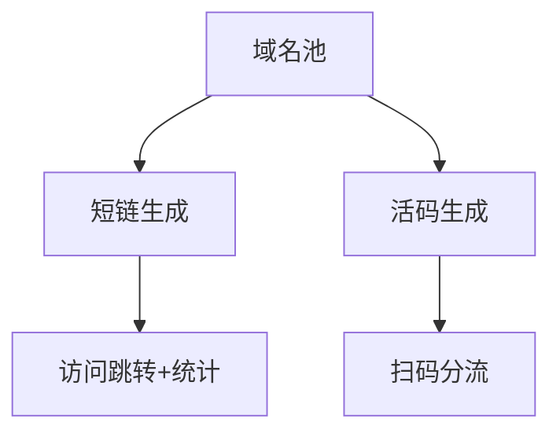

# 七、短链与活码域（3 功能）

---

## 7.1 短链管理（shortlink-management，含统计）
| 端点 | 方法 | 关键入参 | 论证 |
|------|------|----------|------|
| /api/shortlinks | CRUD | `target_url`、`domain_id`、`expire_at`(可选) | `target_url` 须 https + 备案域名（合规）；`domain_id` 来自域名池（7.3）。 |
| GET /s/:code | GET | `code` | 跳转 302 + 统计写入（异步，参考 tracing sink）；防短链暴力枚举（code 长度/熵）。 |
| /api/shortlinks/:id/stats | GET | `range` | 统计分页 + 时间范围。 |

## 7.2 活码管理（livecode-management）
| 端点 | 方法 | 关键入参 | 论证 |
|------|------|----------|------|
| /api/livecodes | CRUD | `type`(个人/群)、`rotate_rule`(按序/权重) | 分流规则须可配；扫码落 `channel`（单值）。 |
| GET /lc/:code | GET | `code` | 分流按 rule 返回目标账号（权重分流需全局计数器，避免并发倾斜）。 |

## 7.3 域名池管理（domain-pool）
| 端点 | 方法 | 关键入参 | 论证 |
|------|------|----------|------|
| /api/domains | CRUD | `domain`、`verified`、`health` | 域名须验证归属（DNS/文件）；被微信/抖音拉黑的域名自动下线（健康度）。 |

---

## 头脑风暴与优化论证（全域）
- **问题**：短链 code 若自增易被枚举遍历；活码权重分流并发倾斜。
- **优化**：code 用随机熵（base62 长短可调）防枚举；活码权重分流用 Redis 原子计数 + 平滑算法（避免瞬时全部打到一个账号被限流）。
- **论证**：防枚举是安全；平滑分流提升账号存活率（渠道限流友好）。
