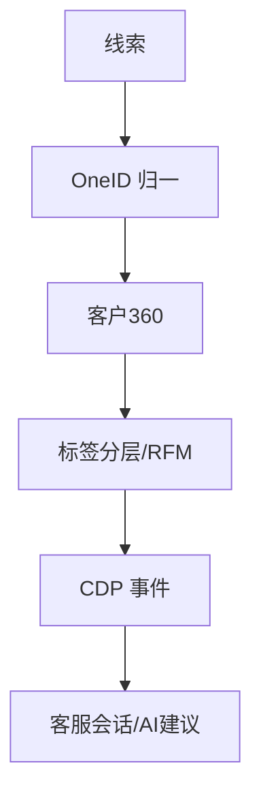

# 八、线索与客户管理域（10 功能）

---

## 8.1 线索管理（clue-management）
| 端点 | 方法 | 关键入参 | 论证 |
|------|------|----------|------|
| /api/clues | CRUD | `contact`、`source`、`score` | `source` 单值渠道；线索去重走 OneID（8.4）防重复建。 |

## 8.2 客户 360 视图（customer-360）
| 端点 | 方法 | 关键入参 | 论证 |
|------|------|----------|------|
| /api/customers/:id/360 | GET | `customer_id` | 聚合线索/会话/订单/事件；权限走行级（12.2 data_scope）。 |

## 8.3 客户事件追踪 CDP（cdp-event-tracking）
| 端点 | 方法 | 关键入参 | 论证 |
|------|------|----------|------|
| /api/cdp/events | POST | `customer_id`、`event`、`props`(json) | 事件 schema 强约束（与 17.1 旅程阶段对齐）；批量上报 + 异步落库。 |
| /api/cdp/events/batch | POST | `events[]` | 批量上限（≤500/批）；失败整批重试（at-least-once）。 |

## 8.4 OneID 身份统一（oneid，归一化/冲突解决）
> 跨功能关键：所有客户查询/分群/触达的统一身份键。
| 端点 | 方法 | 关键入参 | 论证 |
|------|------|----------|------|
| /api/oneid/resolve | POST | `identifiers[]`(phone/unionid/openid...) | 多标识归一：同人不同渠道标识合并为一个 OneID；冲突解决策略可配（保留最早/最近活跃）。 |
| /api/oneid/merge | POST | `from_id`、`to_id` | 合并须迁移关联数据（会话/事件/标签），幂等。 |

### 头脑风暴与优化论证
- **问题**：OneID 合并若漏迁关联数据，会出现「人合并了但历史会话丢主」。
- **优化**：合并走事务 + 关联表级联更新 + 合并审计日志；冲突解决策略可灰度（先影子合并验证再生效）。

## 8.5 标签分层（tag-segmentation）
| 端点 | 方法 | 关键入参 | 论证 |
|------|------|----------|------|
| /api/tags | CRUD | `name`、`rule`(动态条件) | 动态标签规则引擎（类 SOP guard 受限 DSL）；静态/动态标签区分。 |
| /api/segments/members | GET | `segment_id` | 分群成员复用 OneID（8.4），禁止按渠道字符拼查询。 |

## 8.6 / 8.7 / 8.8 / 8.9 / 8.10 客服体系（cs-session / cs-agent / cs-quick-reply / cs-session-tag / cs-ai-suggest）
| 端点 | 方法 | 关键入参 | 论证 |
|------|------|----------|------|
| /api/cs/sessions | CRUD | `customer_id`、`assignee` | 会话与 OneID 关联；分配幂等（同 14.2）。 |
| /api/cs/agents | CRUD | `seat_id`、`status` | 坐席状态（在线/忙/离线）影响分配。 |
| /api/cs/quick-replies | CRUD | `keyword`、`reply` | 快捷回复变量渲染；与话术库（3.9）区分（本库为客服侧）。 |
| /api/cs/sessions/:id/tags | PUT | `tag_ids[]` | 会话标签用于复盘/分群。 |
| /api/cs/ai-suggest | POST | `conversation_id`、`message` | AI 建议走 RAG+记忆（15.1/3.8），不触外发（同 16.3）。 |

---

## 头脑风暴与优化论证（全域）
- **问题**：客户域分散在 10 个功能，跨功能查询各自拼条件，易出「platform 多字符拼查询」违规（架构约束）。
- **优化**：建统一 `CustomerQuery` 服务（入口收 `(channel, account_id, customer_id)` 三元组 + OneID），所有子功能经此查询，强制单值 platform。
- **论证**：统一查询层根除渠道拼接违规，且与 monitor `sync_gap` 三元组判定一致，是一处治理多处的杠杆点。
