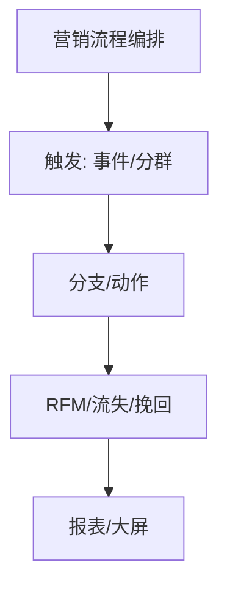

# 九、营销自动化域（8 功能）

---

## 9.1 营销流程编排（marketing-flow）
| 端点 | 方法 | 关键入参 | 论证 |
|------|------|----------|------|
| /api/flows | CRUD | `trigger`、`nodes[]`(DAG)、`version` | 与 SOP（15.3）同构 DAG；触发器幂等（同事件单实例）。 |
| /api/flows/:id/run | POST | `trigger_event` | 运行态隔离；失败节点可重试（对齐 SOP guard 沙箱）。 |

## 9.2 A/B 测试（ab-test）
| 端点 | 方法 | 关键入参 | 论证 |
|------|------|----------|------|
| /api/ab/tests | CRUD | `variants[]`、`split`(比例)、`metric` | `split` 总和为 100%；样本量需统计功效预估（防无效实验）。 |
| /api/ab/tests/:id/result | GET | — | 显著性检验（p-value）；未达显著不提前下定论。 |

## 9.3 RFM 分层（rfm-segment）
| 端点 | 方法 | 关键入参 | 论证 |
|------|------|----------|------|
| /api/rfm/segment | POST | `recency`、`frequency`、`monetary` 阈值 | 分层阈值可配 + 自动（K-means 类）；结果落标签（8.5）。 |

## 9.4 流失预警（churn-prediction）
| 端点 | 方法 | 关键入参 | 论证 |
|------|------|----------|------|
| /api/churn/predict | POST | `customer_ids[]` | 模型增量训练；预警联动挽回队列（9.5）+ 旅程异常（17.1）。 |

## 9.5 流失挽回队列（recovery-queue）
| 端点 | 方法 | 关键入参 | 论证 |
|------|------|----------|------|
| /api/recovery/queue | GET | `priority` | 队列按流失概率排序；挽回动作走 reach-pipeline（15.7）控频。 |

## 9.6 自定义报表（custom-report）
| 端点 | 方法 | 关键入参 | 论证 |
|------|------|----------|------|
| /api/reports | CRUD | `dataset`、`filters`、`chart` | 数据集权限走行级（12.2）；查询超时保护（limit 行数）。 |

## 9.7 数据大屏（dashboard）
| 端点 | 方法 | 关键入参 | 论证 |
|------|------|----------|------|
| /api/dashboard/widgets | CRUD | `metric`、`refresh` | 大屏数据缓存 + 增量刷新；多主题。 |

## 9.8 批量操作（batch-operation）
| 端点 | 方法 | 关键入参 | 论证 |
|------|------|----------|------|
| /api/batch/ops | POST | `op`、`target_ids[]`、`chunk` | 分批（≤200/批）事务；失败可续跑（断点）；与用户管理（1.2）/消息（14.3）复用入口。 |

---

## 头脑风暴与优化论证（全域）
- **问题**：flow/RFM/churn/recovery 各自计算客户分群，重复扫表、口径不一。
- **优化**：建统一「客户计算管道」（定时 + 增量），RFM/流失/标签共用一份特征表，flow 触发直接读结果，避免重复全表扫描。
- **论证**：统一特征表降计算成本、保证口径一致；增量计算降延迟。
- **风险**：特征表变更需版本化，避免历史报表口径漂移。
