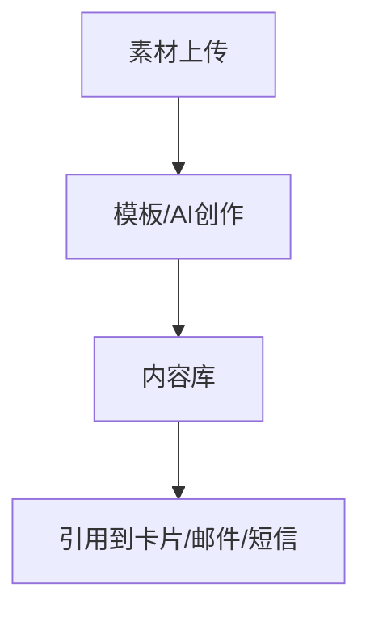

# 十、内容创作域（4 功能）

---

## 10.1 AI 内容创作（ai-content）
| 端点 | 方法 | 关键入参 | 论证 |
|------|------|----------|------|
| /api/ai-content/generate | POST | `prompt`、`tone`、`length`、`product_id`(可选) | 走 LLM 路由（15.4）；`product_id` 可选（rag 全量）。输出侧 forbidden 硬过滤（同 15.6）。 |
| /api/ai-content/:id/variations | GET | — | 多版本产出供挑选；版本化存储。 |

## 10.2 模板市场（template-market）
| 端点 | 方法 | 关键入参 | 论证 |
|------|------|----------|------|
| /api/templates | CRUD | `category`、`body`、`variables` | 变量声明 + 渲染校验；市场模板须审核（防恶意模板）。 |

## 10.3 素材管理（material-management）
| 端点 | 方法 | 关键入参 | 论证 |
|------|------|----------|------|
| /api/materials | CRUD | `type`(img/video/doc)、`oss_key` | 存储走 OBS（11.3）预签名 URL；素材与 content 关联。 |

## 10.4 文件上传（file-upload）
| 端点 | 方法 | 关键入参 | 论证 |
|------|------|----------|------|
| POST /api/upload | POST | `file`、`purpose` | 大小/类型白名单；上传限流 + 病毒扫描（如可达）；返回 oss_key 不暴露密钥。 |

---

## 头脑风暴与优化论证（全域）
- **问题**：AI 创作与模板市场都做「变量渲染 + 校验」，重复实现。
- **优化**：抽 `ContentRenderer`（变量替换 + 长度/合规校验）共用；创作结果可一键落模板市场，形成「创作→复用」闭环。
- **论证**：共用渲染器保证全渠道文案一致性；合规过滤集中在渲染器一处。
