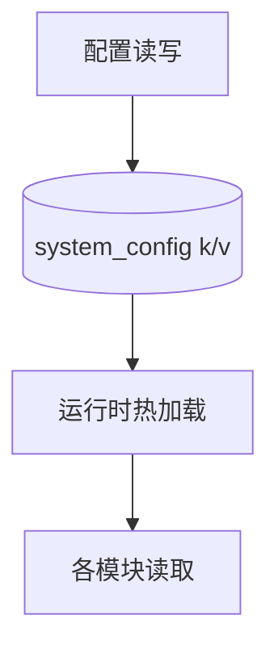
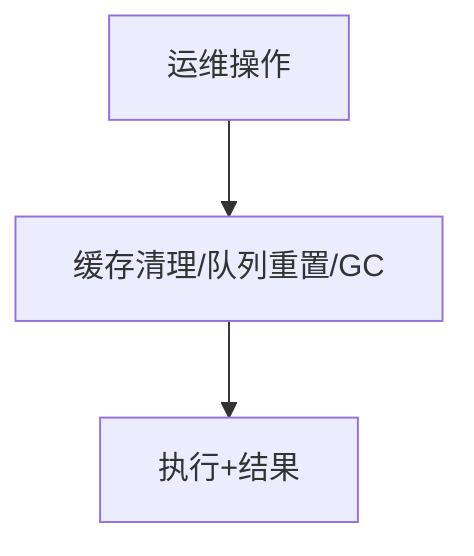
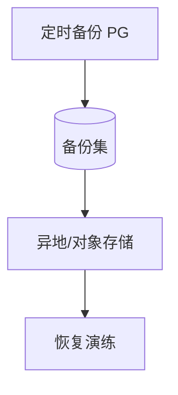
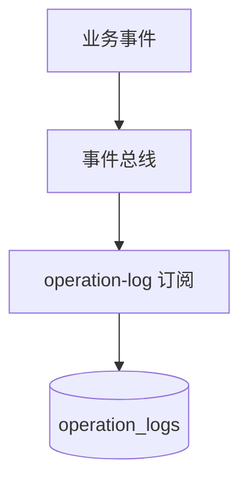
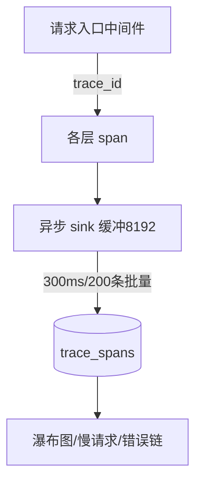
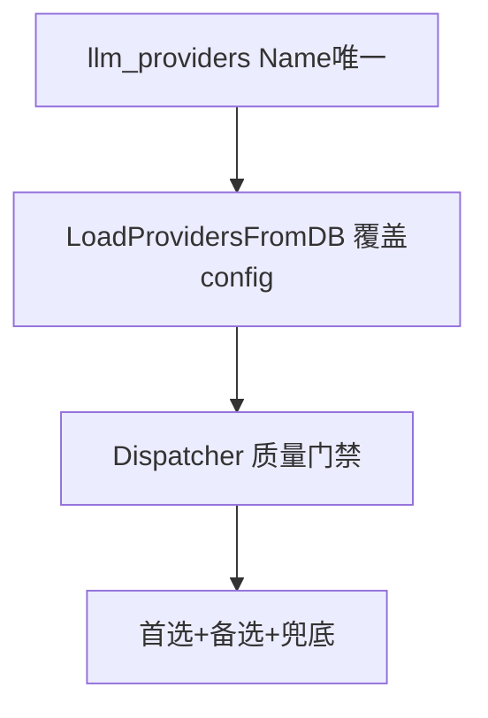
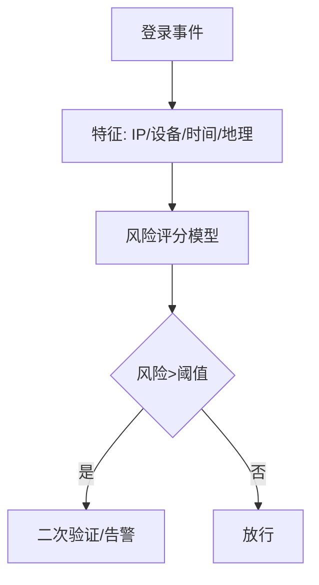

# 十一、系统管理域（11 功能）

---

## 11.1 系统配置（system-config）

### 架构图

### 交互参数（含逐参论证）
| 端点 | 方法 | 关键入参 | 论证 |
|------|------|----------|------|
| /api/system/config | GET/PUT | `key`、`value`、`scope` | `key` 须白名单（防任意写系统键）；`value` 类型校验（bool/int/string/json）。 |
| /api/system/config/reload | POST | — | 热加载须版本号，失败回滚到上一版。 |

### 头脑风暴与优化论证
- **优化**：配置变更走审计（见 11.5 operation-log）；敏感键（密钥类）写后脱敏读。

---

## 11.2 系统运维（system-ops）

### 架构图

### 交互参数（含逐参论证）
| 端点 | 方法 | 关键入参 | 论证 |
|------|------|----------|------|
| /api/system/ops/cache/flush | POST | `prefix`(可选) | `prefix` 必填或全量须二次确认（防误清全缓存雪崩）。 |
| /api/system/ops/queue/reset | POST | `queue` | 队列重置须先 drain，防丢在途消息。 |

### 头脑风暴与优化论证
- **优化**：高危运维操作强制二次确认 + 操作日志；提供 dry-run 预览影响范围。

---

## 11.3 OBS 对象存储配置（obs-config）

### 交互参数
| 端点 | 方法 | 关键入参 | 论证 |
|------|------|----------|------|
| /api/obs/config | CRUD | `endpoint`、`bucket`、`ak/sk`(加密) | ak/sk 加密存储；上传走预签名 URL，前端不直接持密钥。 |

### 头脑风暴与优化论证
- **优化**：多 bucket 按用途隔离（素材/备份/导出）；上传限流 + 病毒扫描（如可达）。

---

## 11.4 备份恢复（backup-recovery）

### 架构图

### 交互参数（含逐参论证）
| 端点 | 方法 | 关键入参 | 论证 |
|------|------|----------|------|
| /api/backup/create | POST | `scope`(full/incremental) | 增量须有基线；备份锁防并发覆盖。 |
| /api/backup/restore | POST | `backup_id`、`target` | 恢复须先校验完整性 + 影响评估（覆盖现有 DB，强确认）。 |

### 头脑风暴与优化论证
- **优化**：恢复改「恢复到新库 + 校验后再切换」，避免恢复即覆盖生产；定期恢复演练（见 anomaly 监控）。

---

## 11.5 操作日志（operation-log，事件总线订阅）

### 架构图

### 交互参数（含逐参论证）
| 端点 | 方法 | 关键入参 | 论证 |
|------|------|----------|------|
| /api/operation-logs | GET | `actor`、`action`、`range` | 敏感操作（删除/权限变更）强制记录；查询分页 + 时间范围必填。 |

### 头脑风暴与优化论证
- **优化**：日志与 security-audit 解耦（operation-log 全量，security-audit 仅管理员手动触发 opt-in，见架构约束）。

---

## 11.6 安全审计（security-audit，opt-in）

> 架构约束：security_audit 改管理员手动触发的 opt-in，严禁无开关默认开启。

### 交互参数
| 端点 | 方法 | 关键入参 | 论证 |
|------|------|----------|------|
| /api/security-audit/scan | POST | `scope`、`depth` | 必须显式触发；扫描结果脱敏存储。 |

### 头脑风暴与优化论证
- **问题**：原 content_auditor / rag_safety_guard 已删除，安全审计仅 opt-in。
- **论证**：符合「严禁无开关默认开启的内容审核/加密/脱敏/行级权限」铁律，正确性已确认，勿回归。

---

## 11.7 全链路追踪驾驶舱（trace-dashboard）

> 6 节点：`ingest→ai_dispatch→outbound_enqueue→inbox_sync→downlink_fetch→delivered_ack`。

### 架构图

### 交互参数（含逐参论证）
| 端点 | 方法 | 关键入参 | 论证 |
|------|------|----------|------|
| /api/trace/search | GET | `trace_id`、`service`、`min_duration`、`status` | span 含 `parent_node/span_kind(lifecycle\|agent_turn\|tool_call)/turn_index/tool_name/agent_id`。 |
| /api/monitor/{health,anomalies,node-health,latency,lifecycle,traces,trace-tree} | GET | — | **InitGuard 端点**；monitor 查 `message_hub`/`inbox_conversations` **严禁 SELECT channel**；所有 `Raw().Scan()` 必须接 `.Error` 检查并打印。 |
| /api/monitor/traces | GET | `node` | `node_abnormal`(tool_call 异常率>5%)：rag.search/knowledge.feedback 的 `product_id` 改可选；vector/bm25 在 `product_id=''` 搜全量。 |

### 头脑风暴与优化论证
- **问题**：`tool_call` 异常 span 须带错误详情；agent_turn span 勿恒写 ok。
- **优化（架构基线）**：RetryDecorator 所有提前返回路径返回完整 `ErrorResult`（ensureErrorResult 守卫）；agent_turn 在 dispatchCtx 取消或任一工具失败时标 `abnormal` 并带首个错误详情（extractToolError 从 LLMToolResult.Content 取 error）。`sync_gap` 按 `(platform,account_id,customer_id)` 三元组判定，凡 sync_gap 一律当真实数据缺陷排查。

---

## 11.8 SSE 实时驾驶舱（sse-dashboard）

### 交互参数
| 端点 | 方法 | 关键入参 | 论证 |
|------|------|----------|------|
| /api/sse/dashboard | GET | `topics[]` | SSE 须关 http2（见 FRP 约束）；topic 订阅须鉴权 + 限订阅范围。 |

### 头脑风暴与优化论证
- **优化**：SSE 与 message-hub SSE（14.3）合并为统一推送网关，避免多长连接；心跳保活 + 断线重连。

---

## 11.9 LLM Provider 降级管理（llm-provider）

### 架构图

### 交互参数（含逐参论证）
| 端点 | 方法 | 关键入参 | 论证 |
|------|------|----------|------|
| /api/llm-providers | CRUD | `name`(唯一)、`enabled`、`quality_gate` | `Name` 唯一；DB 为真相，`LoadProvidersFromDB()` 覆盖 config。工具名正则 `^[a-zA-Z0-9_-]+$`。 |
| /api/llm-providers/reload | POST | — | 重载须原子（全量替换内存映射），避免半载状态。 |

### 头脑风暴与优化论证
- **论证**：Dispatcher 兜底——首选+备选全跳过时自动兜底任意已启用且过质量门禁 provider，是可用性锚点。
- **优化**：质量门禁指标可视化（成功率/延迟/P95），劣化自动降权。

---

## 11.10 调参面板（tuning-panel，置信度/拟人度/反馈学习）

### 交互参数
| 端点 | 方法 | 关键入参 | 论证 |
|------|------|----------|------|
| /api/tuning/config | PUT | `confidence`、`humanize`、`learning_rate` | 调参实时生效但须可回滚（版本化）。 |
| /api/tuning/learning | GET | — | 自学习 `trace_learning`：四维度打分(relevance/accuracy/usefulness/safety)，差×0.85、好×1.12，clamp[0.1,3.0]。 |

### 头脑风暴与优化论证
- **论证**：「LLM 返回空」已修：`eval MaxTokens=2560` + chatMessage 增加 `reasoning/reasoning_content` 兜底。`RunBatch` dry-run、worker 池 + adjustMu 串行调权、`hours` opt-in(0=全量)；`EvaluateTrace` 块内 `adjusted, e =`（勿 `:=` 遮蔽）；咨询锁用 db.Connection 专用连接。

---

## 11.11 异常登录检测（anomaly-login-detector）

### 架构图

### 交互参数（含逐参论证）
| 端点 | 方法 | 关键入参 | 论证 |
|------|------|----------|------|
| /api/anomaly/login/events | GET | `user_id`、`risk_level` | 检测与阻断分离：检测仅告警，阻断走登录流程 hook。 |
| /api/anomaly/login/whitelist | CRUD | `ip`/`device` | 白名单误报反馈闭环。 |

### 头脑风暴与优化论证
- **优化**：检测模型增量更新（新登录样本回流），避免规则僵化；与 operation-log 联动审计高风险登录。
