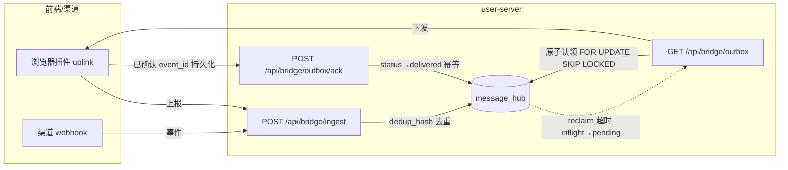
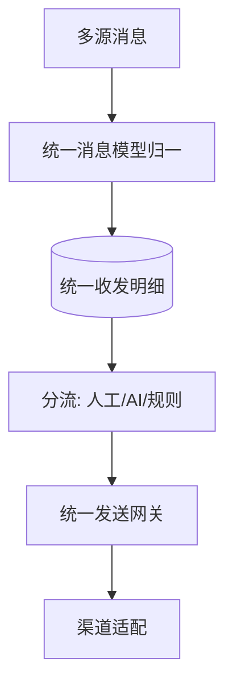
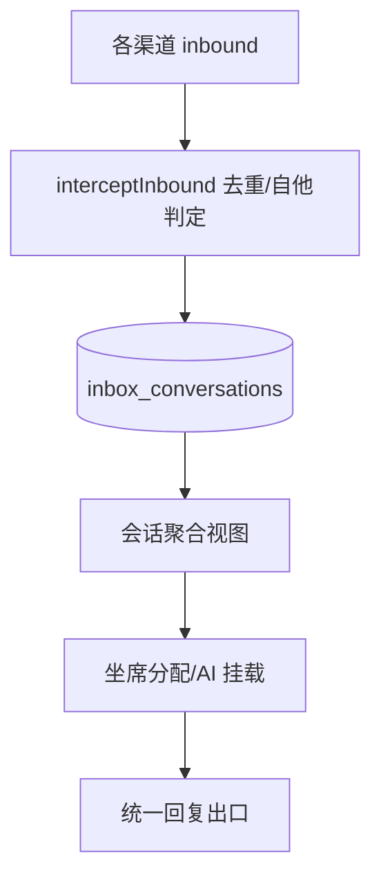
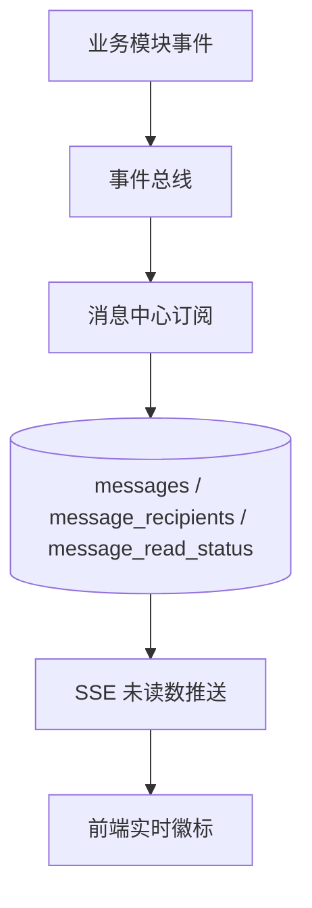
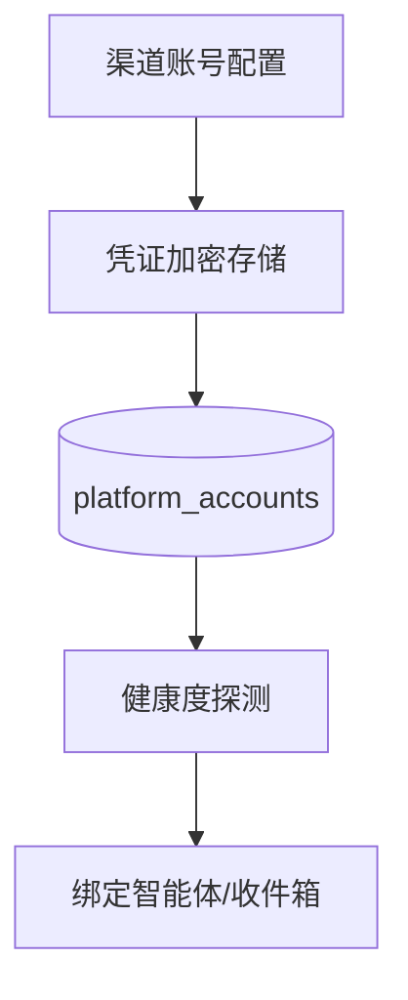

# 十四、统一消息域（4 功能 + 桥接三通道）

> 本域是**消息可靠性锚点**。桥接三通道（上报/状态/下发）的架构约束见总览 §二.1，是论证基线，优化时严禁回归。

---

## 14.0 桥接三通道（ingest / outbox / ack）— 跨功能架构锚点

### 架构图

### 关键交互参数（含逐参论证）
| 端点 | 方法 | 关键入参 | 论证 |
|------|------|----------|------|
| /api/bridge/ingest | POST | `channel`(xiaohongshu/douyin 全名, 白名单)、`account_id`、`conversation_id`、`event_id`、`content`、`sender_type` | **不信任前端 sender_type**（回环/自他判定统一服务端 `interceptInbound`，dedup_hash + ContentHashWithSender）。`event_id` 用于 `isIngestDuplicate` 覆盖 intercepted/echo/duplicate/skip/already exists。 |
| /api/bridge/outbox | GET | `channel`、`account_id`、`cursor` | 服务端权威下发；claim 子查询必须 `FOR UPDATE SKIP LOCKED`（否则 READ COMMITTED 下重复认领→重复转发）。`claimed_at` 标记 inflight。 |
| /api/bridge/outbox/ack | POST | `channel`、`account_id`、`msg_ids[]`、`status` | `AckOutboundDeliveredBatch` 翻 `pending/inflight→delivered`（幂等），WHERE 锁 `(channel,account_id,msg_id)`。`pollDownlink` 刻意「先转发→再 ack→最后写本地缓存」（优先不丢消息）。 |

### 跨语言哈希契约（最高优先级论证）
`webhook.go::ContentHashMsgID` 与前端 `types.js::contentHash` 必须逐字节一致：FNV-1a 32 位，输入 `channel|trim(content)`（**不含 conversationID**），UTF-8 字节，输出 `mh:${8位hex}`。锚点：`contentHash("douyin","c1","你好")==="mh:00550fed"`。
**论证**：双端哈希不一致会导致去重失效 / 重复转发 / 消息丢失，且极难排查。任何优化（如加字段、换算法）必须双端同步并加契约测试。

---

## 14.1 统一消息（unified-message）

### 架构图

### 交互参数（含逐参论证）
| 端点 | 方法 | 关键入参 | 论证 |
|------|------|----------|------|
| /api/unified-message/send | POST | `channel`、`account_id`、`to`、`content`、`template_id`(可选) | `channel` 单值事实源（架构约束：严禁合并不同渠道为一个字符再当查询条件）；`to` 须按渠道格式校验（抖音/小红书 ID 规则不同）。 |
| /api/unified-message/templates | CRUD | `channel`、`body`、`variables` | 模板变量须声明类型，发送前强校验，避免注入到渠道协议层。 |

### 头脑风暴与优化论证
- **问题**：多源消息归一时若按渠道字符拼接会丢 platform 语义（架构约束已禁止）。
- **优化**：统一模型以 `(channel, account_id)` 为一级键，所有查询走单值 `channel`；新增「渠道能力矩阵」配置（是否支持图片/卡片/撤回），发送前能力协商。
- **论证**：能力协商避免对不支持的渠道发富媒体导致失败。

---

## 14.2 统一收件箱（unified-inbox）

### 架构图

### 交互参数（含逐参论证）
| 端点 | 方法 | 关键入参 | 论证 |
|------|------|----------|------|
| /api/unified-inbox/conversations | GET | `channel`(单值)、`assignee`、`status` | `inbox_conversations` **无 channel 列**（约束）：查询去重键为 `(platform, account_id, customer_id)` 三元组；monitor 查此表严禁 `SELECT channel`。 |
| /api/unified-inbox/assign | POST | `conversation_id`、`agent_id` | 分配须幂等（同会话重复分配不新建）；AI 挂载见 16.3。 |

### 头脑风暴与优化论证
- **问题**：`sync_gap` 按三元组判定（架构约束），凡 sync_gap 一律当真实数据缺陷排查，禁归「设计内」。
- **优化**：收件箱增加「同步健康度」实时指标（上次同步时间 + gap 阈值告警），与 trace node `inbox_sync` 联动；缺失会话触发主动 `inbox_sync` 补偿任务。

---

## 14.3 消息中心（message-hub）

> 注意：此处 `message-hub` 是**站内消息中心**（系统通知/任务提醒/客户消息汇总），与桥接 `message_hub` 表同名但语义不同，文档已单列。详见 [`../marketing-features/message-hub.md`](../marketing-features/message-hub.md)。

### 架构图

### 交互参数（含逐参论证）
| 端点 | 方法 | 关键入参 | 论证 |
|------|------|----------|------|
| /api/message-hub/list | GET | `type`(system/task/customer)、`read_status`、分页 | `type` 枚举强约束；分页必填 `page_size` 上限（防一次性拉全量）。 |
| /api/message-hub/sse | GET | — | SSE 长连接推送未读数；连接断开客户端重连后拉最新（见原文档 6.2）。 |
| /api/message-hub/batch-read | PUT | `ids[]` | 批量标记须事务 + 上限（单次 ≤200），超量分批。 |

### 头脑风暴与优化论证
- **待完成项**（原文档 1.2）：消息智能聚合（同类合并）。
- **优化**：同类消息按 `(type, source, 时间窗口)` 折叠为一条 + 计数；高并发写入走批量 insert（参考 tracing sink 批 200 模式），降 DB 压力。

---

## 14.4 平台账号管理（platform-account）

### 架构图

### 交互参数（含逐参论证）
| 端点 | 方法 | 关键入参 | 论证 |
|------|------|----------|------|
| /api/platform-accounts | CRUD | `channel`、`credentials`(加密)、`health_check_url` | 凭证**严禁明文落库**（已删 content_auditor 等，但凭证加密是独立基线）；`channel` 单值。 |
| /api/platform-accounts/:id/health | GET | — | 健康度与 bridge claim 超时联动（inflight 超时→reclaim→pending）。 |

### 头脑风暴与优化论证
- **优化**：账号健康度与「桥接 claim 超时 reclaim」共用一个超时配置中心，避免两处阈值不一致导致「账号假死却不下发」或「过早 reclaim 重复下发」。
