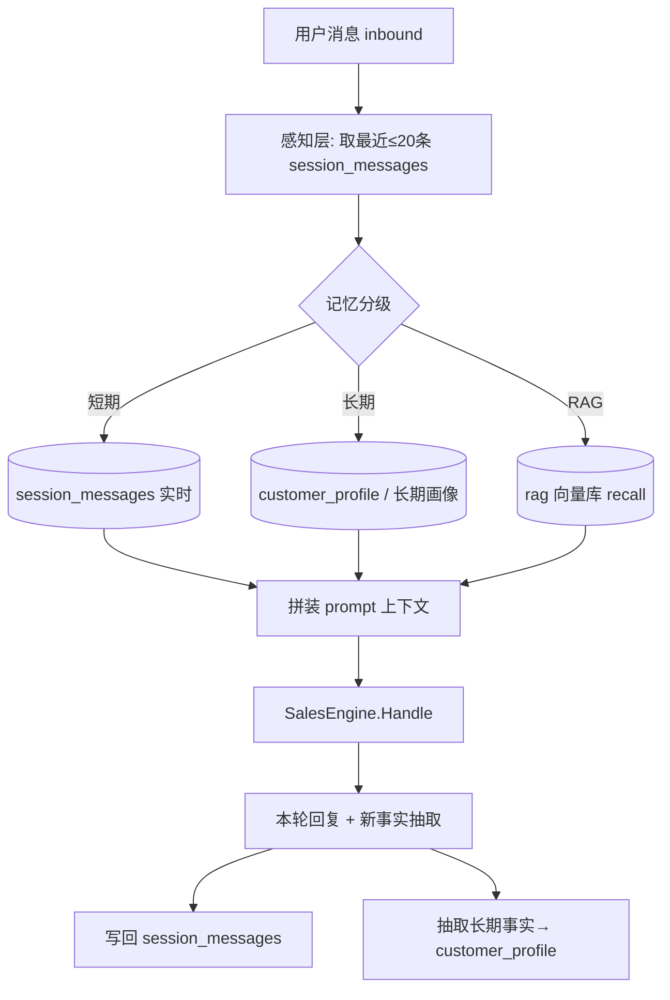
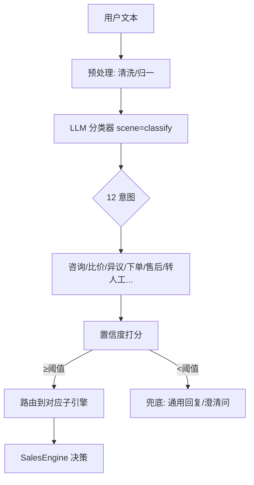
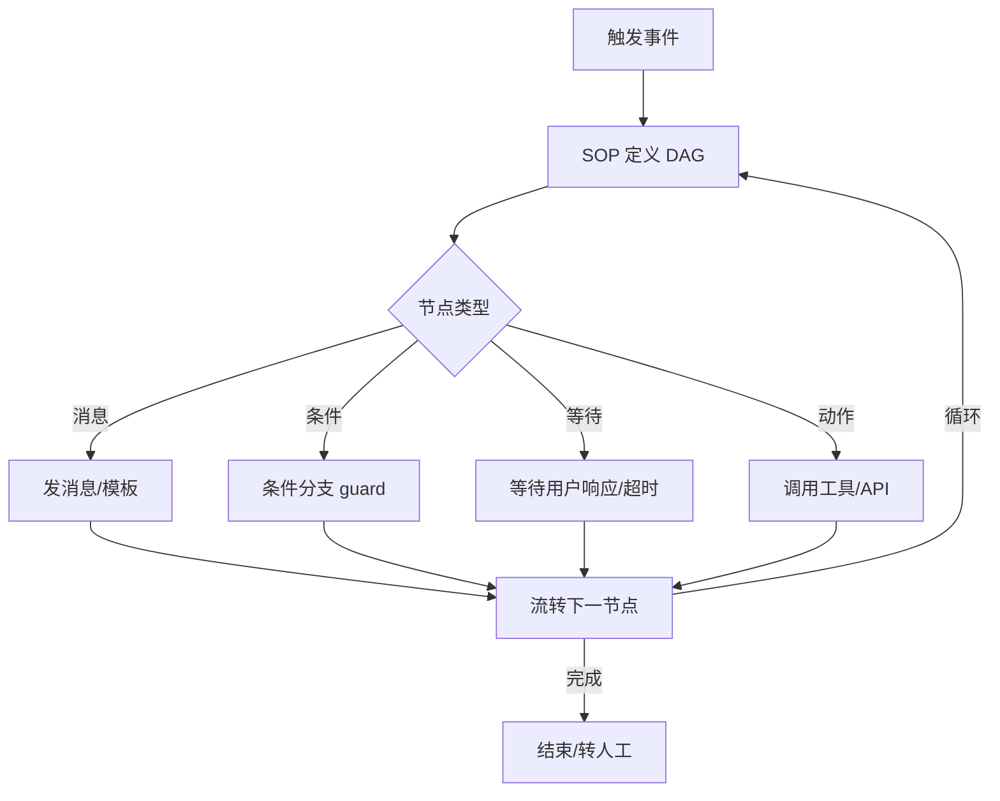
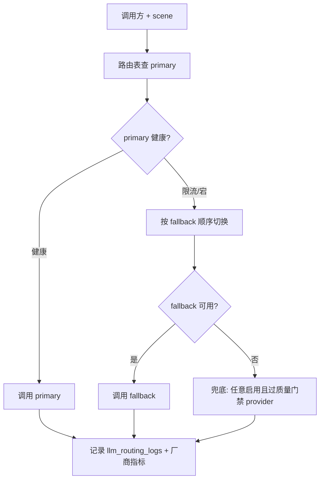
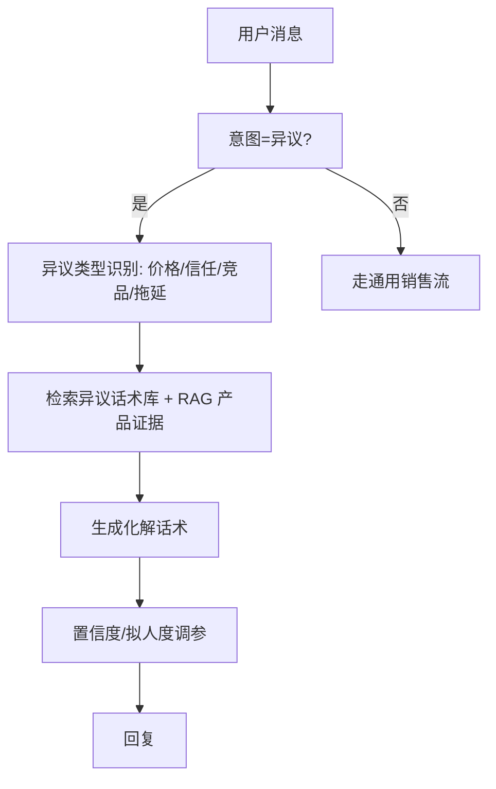
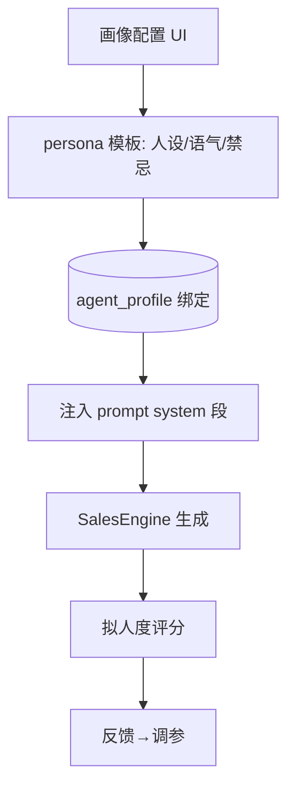
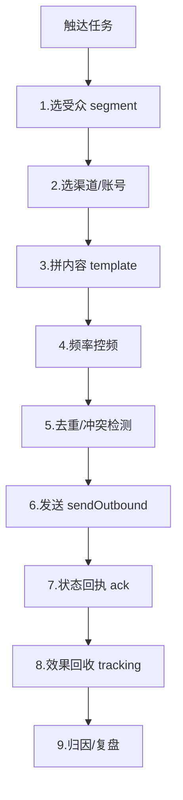

# 十五、AI 销冠核心域（7 功能）

> 围绕 `sales_engine.Engine.Handle()` 主流程（感知 → 决策 → 行动 → 记忆）构建。
> 生产路径：`SmartCSOrchestrator → SalesEngine` → 工厂注入 `ToolExecutor` → `runAgentLoop`（非 `buildPrompt` 兜底）。
> 多轮记忆：从 `session_messages` 取最近 ≤20 条注入（剔除本轮）。

---

## 15.1 对话记忆中心（dialogue-memory）

### 架构图

### 交互参数（含逐参论证）
| 端点 | 方法 | 关键入参 | 论证 |
|------|------|----------|------|
| /api/dialogue/memory | GET | `session_id`(必填, 记忆归属键)、`limit`(默认20, ≤20 防上下文爆炸)、`types`(short/long/rag 多选) | `limit` 上限 20 是架构锚点：超过会压垮 context 且成本陡增；论证建议**硬上限 + 软策略**（相关性排序后截断）而非固定 20。 |
| /api/dialogue/memory/compress | POST | `session_id`、`strategy`(summary/extract) | 长会话压缩策略须可配置；当前若仅 summary 会丢结构化事实。`types=rag` 召回应带 `product_id` 可选（见 node_abnormal 约束）。 |
| /api/dialogue/fact/extract | POST | `session_id`、`content` | 事实抽取落 `customer_profile` 须去重（OneID 归一），否则画像膨胀。 |

### 头脑风暴与优化论证
- **问题**：固定 ≤20 条是「数量截断」而非「相关性截断」，重要早期意图可能被后 20 条淹没。
- **优化**：改为「相关性 + 时间衰减」双权重打分后取 top-K（K 仍 ≤20），关键事实（异议、预算、决策人）加权保活。
- **论证**：成本不变（仍 ≤20 token 预算），但召回质量上升；需新增 `memory_rank` 字段与离线重排任务。
- **风险**：重排引入延迟，建议在 `runAgentLoop` 前并行预取（异步非阻塞，参考 tracing sink 模式）。

---

## 15.2 意图识别中心（intent-recognition，12 意图）

### 架构图

### 交互参数（含逐参论证）
| 端点 | 方法 | 关键入参 | 论证 |
|------|------|----------|------|
| /api/intent/recognize | POST | `content`(必填)、`session_id`、`agent_id` | `agent_id` 决定意图 schema（不同智能体意图集不同），不可省略；论证：意图须与绑定的 SOP/知识库对齐。 |
| /api/intent/feedback | POST | `intent_id`、`correct`(bool)、`actual` | 反馈学习闭环（见 tuning-panel）；论证：错分样本须回流到 `trace_learning` 四维度打分，权重 ×0.85/×1.12。 |

### 头脑风暴与优化论证
- **问题**：12 意图平铺分类，长尾意图（如「投诉 escalation」）样本稀，易错分。
- **优化**：两级分类（先大类 4 类 → 再细类），降低混淆；阈值按意图独立校准（高后果意图如「转人工/下单」阈值更低以保召回）。
- **论证**：两级分类只多一次小模型调用，延迟可忽略；高后果意图降阈值是安全权衡（宁错杀勿漏）。
- **风险**：意图与 SOP 强耦合，改意图集须同步迁移 SOP 节点（DAG 版本化）。

---

## 15.3 SOP 智能体（sop-agent，DAG 流转）

### 架构图

### 交互参数（含逐参论证）
| 端点 | 方法 | 关键入参 | 论证 |
|------|------|----------|------|
| /api/sop/definitions | CRUD | `dag_json`(节点+边+guard)、`version`(乐观锁) | DAG 须版本化（见 15.2 风险）；`guard` 表达式须沙箱执行，禁止 `eval` 直跑用户脚本。 |
| /api/sop/instances | POST | `definition_id`、`trigger`(事件/手动)、`context` | 实例上下文隔离：同 SOP 多实例不能串号；`trigger=event` 须幂等（同事件只起一个实例）。 |
| /api/sop/instances/:id/step | PUT | `node_id`、`action`(advance/rollback) | 人工介入节点需审批流；rollback 须校验 DAG 可达性避免环路。 |

### 头脑风暴与优化论证
- **问题**：DAG guard 用动态表达式存在注入/死循环风险；超时等待节点无统一 TTL 治理。
- **优化**：guard 改为受限 DSL（字段比较 + 逻辑运算）编译执行；等待节点强制 `max_wait` 上限 + 超时自动降级分支；增加「循环次数上限」防 DAG 自转。
- **论证**：受限 DSL 牺牲灵活性换安全，对营销 SOP 足够；TTL 治理避免挂起实例占资源。
- **风险**：改 guard 引擎需兼容存量 DAG（提供迁移校验脚本）。

---

## 15.4 LLM 多模型路由（llm-routing，6 厂商/8 场景）

### 架构图

### 交互参数（含逐参论证）
| 端点 | 方法 | 关键入参 | 论证 |
|------|------|----------|------|
| /api/llm-routings/resolve | POST | `scene`(必填, 8 场景之一)、`prefer_provider`(可选) | `scene` 决定主模型（复杂异议→强模型）；`prefer_provider` 仅管理员调试用，不可被外部请求强制指定厂商（防成本滥用）。 |
| /api/llm-routings | CRUD | `primary_provider`、`fallback_providers[]`、`weight`、`rate_limit`(QPS) | `rate_limit` 须全局令牌桶（跨实例共享，Redis），否则单实例限流在多副本下失效。 |
| /api/llm-routings/providers/health | GET | — | 健康探测间隔 30s；**关键**：`reasoning` 模型 `max_tokens` 基线 ≥2048，路由层兜底补默认值，否则截断空回复。 |

### 头脑风暴与优化论证
- **问题**：fallback 顺序固定，热门场景全压同一 fallback 形成惊群；`rate_limit` 单实例有效。
- **优化**：fallback 改为「加权随机 + 健康加权」（非纯顺序）；限流改 Redis 共享令牌桶；新增「成本预算」维度，超预算场景自动降档到廉价模型。
- **论证**：加权随机平摊压力；成本预算是 SaaS 必需护栏（防单商户烧穿额度）。
- **风险**：加权随机降低可预测性，需路由日志可追溯（已有 llm_routing_logs）。

---

## 15.5 异议处理（objection-handler）

### 架构图

### 交互参数（含逐参论证）
| 端点 | 方法 | 关键入参 | 论证 |
|------|------|----------|------|
| /api/objection/types | GET | — | 异议类型字典；须与 intent 12 意图中的「异议」对齐，避免两套分类。 |
| /api/objection/handle | POST | `session_id`、`objection_type`、`product_id`(可选) | `product_id` 可选（遵循 node_abnormal：rag.search 在 product_id='' 时搜全量）；论证：竞品异议不应被单一产品知识误导。 |
| /api/objection/feedback | POST | `handled_id`、`effective`(bool) | 有效性回流到话术排序与 `trace_learning`。 |

### 头脑风暴与优化论证
- **问题**：异议化解过度依赖话术库，遇未见异议易模板化、被识破「机器人」。
- **优化**：引入「共情先行 + 证据后置」两段式；未命中话术时降级到 RAG 证据 + 拟人度调参（见 tuning-panel）；记录「被识破」信号（用户反问「你是机器人吗」）触发降速。
- **论证**：两段式提升真实感；拟人度是设计内调参维度，非缺陷。
- **风险**：降速影响转化节奏，需 A/B 验证（见 ab-test）。

---

## 15.6 销冠画像（sales-persona，独立 UI）

### 架构图

### 交互参数（含逐参论证）
| 端点 | 方法 | 关键入参 | 论证 |
|------|------|----------|------|
| /api/persona | CRUD | `tone`(语气)、`forbidden`(禁忌词)、`sample_dialog` | `forbidden` 须做输出侧硬过滤（生成后正则屏蔽），不能只靠 prompt 约束（prompt 可被越狱）。 |
| /api/persona/bind | POST | `agent_id`、`persona_id` | 一个智能体绑定一个画像；多智能体共享画像需拷贝而非引用（避免一处改全变）。 |

### 头脑风暴与优化论证
- **问题**：画像仅靠 system prompt，越狱/长对话漂移会破坏人设一致性。
- **优化**：输出侧加 `forbidden` 硬过滤 + 周期性「人设一致性自检」（每 N 轮用轻模型打分，漂移则重注 system 段）；画像 diff 可版本化回滚。
- **论证**：硬过滤是安全兜底，与 prompt 软约束互补；自检成本极低（轻模型）。

---

## 15.7 触达 Pipeline（reach-pipeline，9 步执行）

### 架构图

### 交互参数（含逐参论证）
| 端点 | 方法 | 关键入参 | 论证 |
|------|------|----------|------|
| /api/reach/pipelines | CRUD | `steps`(9 步配置)、`schedule`(cron) | 每步可开关；控频步（`4`）须全局频控（同用户跨任务去重），否则多渠道轰炸。 |
| /api/reach/run | POST | `pipeline_id`、`audience_filter` | `audience_filter` 复用 OneID 归一结果，禁止按渠道单字符拼查询（架构约束：platform 必须单值事实源）。 |
| /api/reach/status/:msg_id | GET | `msg_id` | 状态须对齐 message_hub（`pending/inflight/delivered`），走 claim/ack 闭环。 |

### 头脑风暴与优化论证
- **问题**：步骤 4 控频若仅任务内有效，多 pipeline 并行会叠加触达；步骤 5 冲突检测滞后。
- **优化**：控频改为「用户级全局频控」（Redis 滑动窗口，跨 pipeline 共享）；冲突检测前置到步骤 2（渠道账号占用锁），避免发送中才发现冲突。
- **论证**：全局频控防骚扰是合规底线；前置锁降低无效发送成本。
- **风险**：全局频控引入跨 pipeline 状态，需考虑用户注销/撤回同意的即时生效（GDPR 类合规）。
