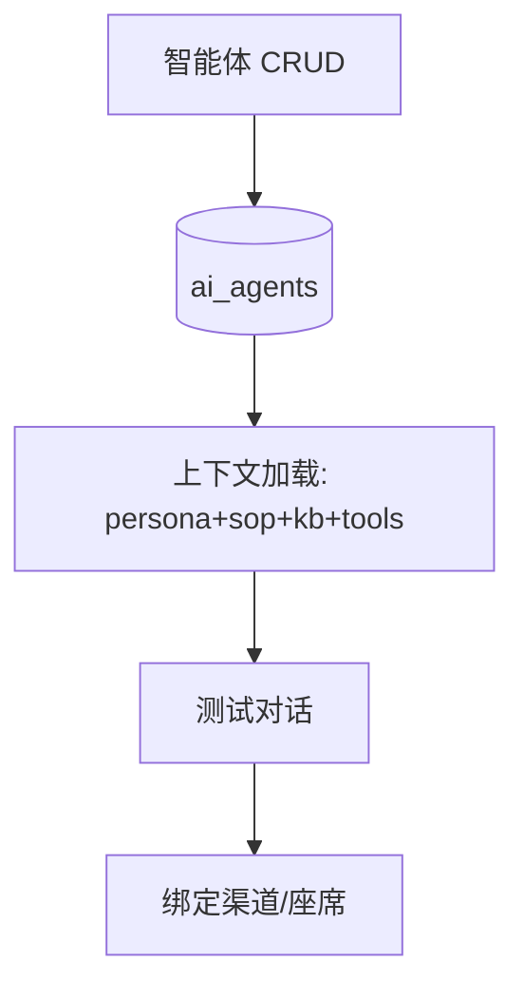
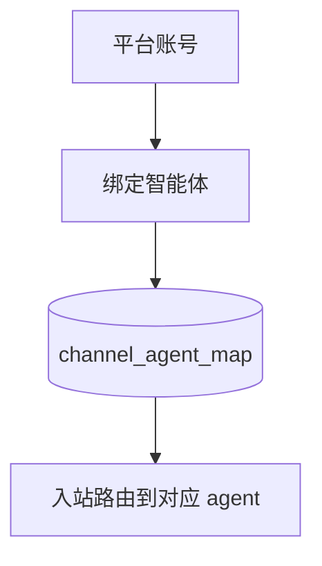
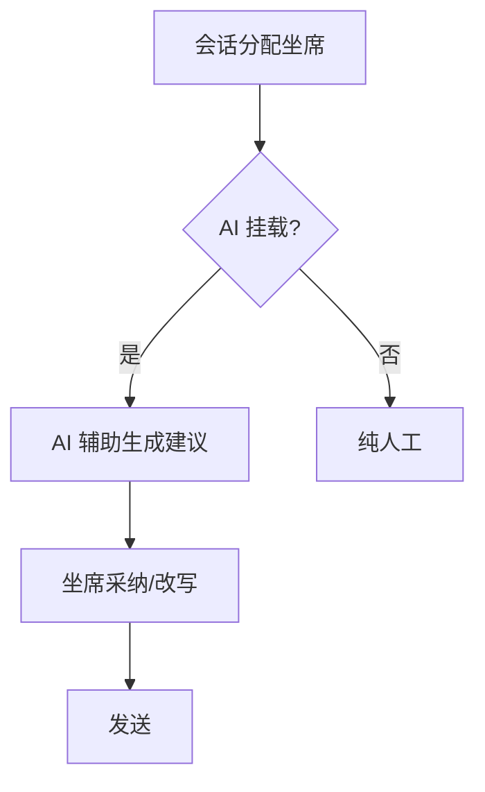

# 十六、多 AI 智能体域（3 功能）

> 一个商户可配置多个独立智能体（销售型/客服型/混合型），每个绑定不同 LLM、SOP、知识库。

---

## 16.1 多 AI 智能体管理（ai-agent）

### 架构图

### 交互参数（含逐参论证）
| 端点 | 方法 | 关键入参 | 论证 |
|------|------|----------|------|
| /api/agents | CRUD | `type`(sales/cs/hybrid)、`llm_routing_id`、`sop_id`、`kb_ids[]` | `type` 决定默认意图集（与 15.2 对齐）；绑定引用须校验存在性。 |
| /api/agents/:id/test | POST | `message` | 测试对话隔离（不落真实会话/不触发真实发送）；产物可丢弃。 |
| /api/agents/:id/context | GET | — | 上下文加载须缓存（避免每次请求重拼装大上下文）。 |

### 头脑风暴与优化论证
- **问题**：多智能体上下文拼装重复计算，冷启动慢。
- **优化**：上下文按 `(agent_id, version)` 缓存 + 失效订阅；测试对话走影子上下文（不污染画像/记忆）。

---

## 16.2 渠道账号绑定智能体（channel-agent-binding）

### 架构图

### 交互参数（含逐参论证）
| 端点 | 方法 | 关键入参 | 论证 |
|------|------|----------|------|
| /api/channel-agent/bind | POST | `account_id`、`agent_id` | 一个账号绑定一个主 agent；解绑须先停该账号 inbound 路由（防路由悬空）。 |
| /api/channel-agent/route | GET | `account_id` | 路由查询须缓存（每秒高并发 inbound 不宜每次查 DB）。 |

### 头脑风暴与优化论证
- **优化**：支持「主 agent + 兜底 agent」（主 agent 异常时降级到兜底），与 llm-provider 兜底理念一致。

---

## 16.3 客服座席挂载智能体（cs-agent-mount）

### 架构图

### 交互参数（含逐参论证）
| 端点 | 方法 | 关键入参 | 论证 |
|------|------|----------|------|
| /api/cs/agent/mount | POST | `agent_id`、`seat_id`、`mode`(suggest/auto) | `mode=auto` 须二次确认（自动回复风险）；`suggest` 为默认安全模式。 |
| /api/cs/agent/suggest | POST | `conversation_id`、`message` | 建议生成走 RAG+记忆（15.1），不触达外发（仅回写坐席 UI）。 |

### 头脑风暴与优化论证
- **优化**：挂载配置与 16.2 渠道绑定统一为「路由策略中心」，避免账号级与座席级两套路由逻辑冲突。
