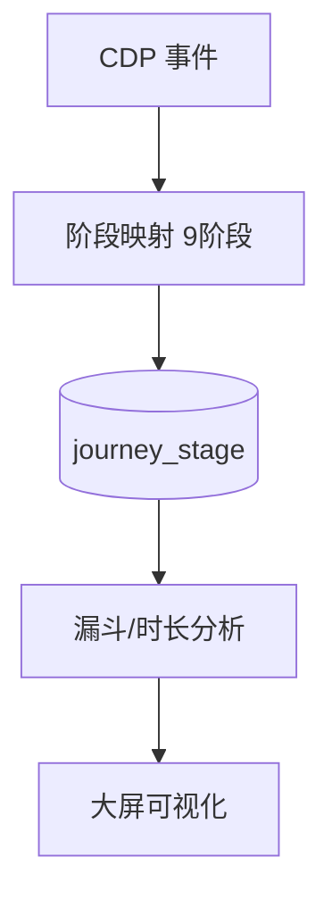
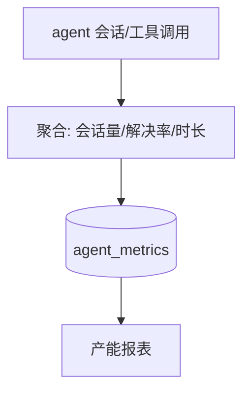

# 十七、数据分析域（3 功能）

---

## 17.1 客户旅程大屏（customer-journey，9 阶段监控）

### 架构图

### 交互参数（含逐参论证）
| 端点 | 方法 | 关键入参 | 论证 |
|------|------|----------|------|
| /api/journey/stages | GET | `customer_id`、`range` | 阶段定义须与 CDP 事件 schema 对齐（见 8.3 cdp-event-tracking）；`range` 必填防全量扫描。 |
| /api/journey/metrics | GET | `segment` | segment 复用 OneID 归一结果（8.4）。 |

### 头脑风暴与优化论证
- **优化**：阶段停留时长异常（过长=卡住/流失前兆）联动 churn-prediction（9.4）；旅程与 sync_gap 三元组一致性校验。

---

## 17.2 转化漏斗（conversion-funnel）

### 交互参数
| 端点 | 方法 | 关键入参 | 论证 |
|------|------|----------|------|
| /api/funnel | GET | `steps[]`、`range` | `steps` 顺序敏感（漏斗方向）；支持 A/B 维度拆分（见 9.2 ab-test）。 |

### 头脑风暴与优化论证
- **优化**：漏斗与 reach-pipeline（15.7）归因打通，区分「自然转化」与「触达转化」。

---

## 17.3 智能体产能（ai-productivity）

### 架构图

### 交互参数（含逐参论证）
| 端点 | 方法 | 关键入参 | 论证 |
|------|------|----------|------|
| /api/agent-productivity | GET | `agent_id`、`range` | 数据源来自 trace tool_call span（11.7）；解决率定义须与 cs-session 闭环状态一致。 |

### 头脑风暴与优化论证
- **优化**：产能与 trace_learning 四维度打分（11.10）关联，低分 agent 自动标记待调优。
