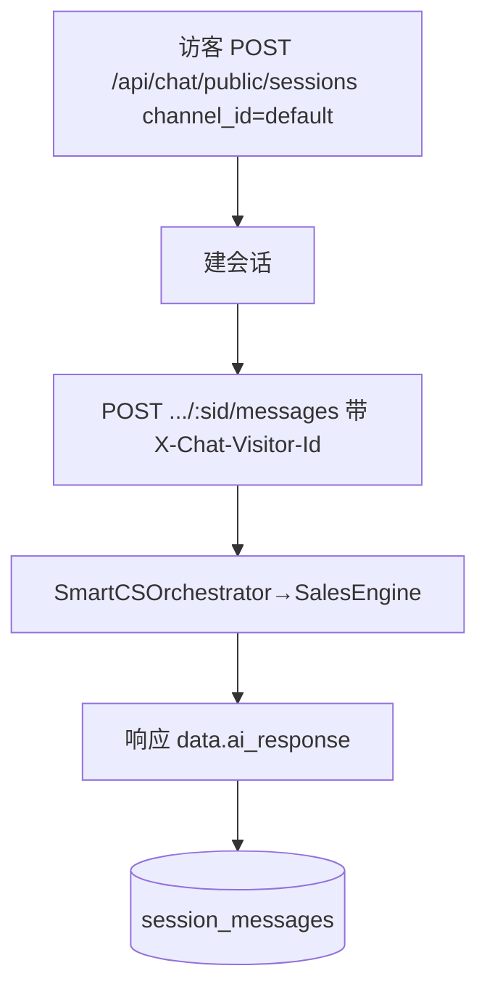

# 十八、客服 Web Widget 域（1 功能）

> 渠道 `web_embed`，智能体 83 = `seed-hivemtk-product-service`。访客 AI 回答在响应 `data.ai_response`（不经 WS）。

---

## 18.1 客服 Web Widget 渠道管理（chat-channel）

### 架构图

### 交互参数（含逐参论证）
| 端点 | 方法 | 关键入参 | 论证 |
|------|------|----------|------|
| /api/chat/public/sessions | POST | `channel_id`(默认 default) | 公开端点（uid==0 不 401，见桥接端点约束）；`channel_id` 默认 `default`，多站点可区分。 |
| /api/chat/public/sessions/:sid/messages | POST | `X-Chat-Visitor-Id`(必填,否则400)、`content` | **缺 `X-Chat-Visitor-Id` 返回 400**（严格校验，防匿名刷）；AI 回答在 `data.ai_response`，不经 WS（与桥接 WS 路径区分）。 |
| /api/chat/public/sessions/:sid | GET | `visitor_id` | 会话归属按 visitor_id，非 uid（单租户私域，设计内 IDOR 不修）。 |

### 头脑风暴与优化论证
- **问题**：访客会话无频控，易被刷量/灌水。
- **优化**：按 `X-Chat-Visitor-Id` + IP 做轻量频控（Redis 滑动窗口）；访客身份与 OneID（8.4）打通，登录后自动归一历史会话。
- **论证**：频控是公开端点的必要护栏；归一提升跨端体验（设计内预期不修 IDOR，但可加频控）。
- **RAG**：vector+BM25+bge-reranker 三级（同 3.8），`product_id` 可选。
