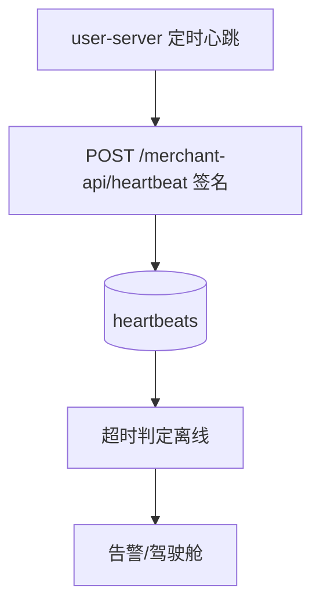

# 十九、平台端域（10 功能，独立仓库 hivemtk-platform）

> 平台端 = 商户主体管理、心跳/安装统计、官网联系信息维护。运行跨域调用：`merchant-api` 由 user-server 签名鉴权调用（区别于 `/platform/*` 的 JWT 鉴权）。

---

## 19.1 平台认证（platform-auth）
| 端点 | 方法 | 关键入参 | 论证 |
|------|------|----------|------|
| /platform/auth/login | POST | `username`、`password` | 平台管理员独立账号体系（区别于用户端 1.1）；JWT。 |

## 19.2 驾驶舱（platform-dashboard）
| 端点 | 方法 | 关键入参 | 论证 |
|------|------|----------|------|
| /platform/dashboard | GET | `range` | 聚合商户数/活跃/告警；数据来自 stats（19.6）。 |

## 19.3 商户管理（platform-merchant，CRUD/审批/统计）
| 端点 | 方法 | 关键入参 | 论证 |
|------|------|----------|------|
| /platform/merchants | CRUD | `status`(pending/approved/rejected)、`owner` | 审批流幂等；与用户端 merchant-initialization（1.3）跨仓库对齐。 |

## 19.4 心跳监控（platform-heartbeat）

| 端点 | 方法 | 关键入参 | 论证 |
|------|------|----------|------|
| /merchant-api/heartbeat | POST | `merchant_id`、`sign`、`ts` | **签名鉴权**（非 JWT）；`ts` 防重放（窗口内拒旧包）。 |

## 19.5 安装信息（platform-install）
| 端点 | 方法 | 关键入参 | 论证 |
|------|------|----------|------|
| /merchant-api/install | POST | `merchant_id`、`version`、`env` | 上报版本便于统一升级治理；`version` 用于兼容性判断。 |

## 19.6 平台统计（platform-stats）
| 端点 | 方法 | 关键入参 | 论证 |
|------|------|----------|------|
| /platform/stats | GET | `dimension`(system/overview/merchant) | 聚合维度受权限（12.1 类比）；大数据量走预聚合表。 |

## 19.7 系统监控（platform-monitoring）
| 端点 | 方法 | 关键入参 | 论证 |
|------|------|----------|------|
| /platform/monitoring | GET | `metric`(health/api/perf) | 与用户端 trace（11.7）/ anomaly（11.11）互补；跨端健康总览。 |

## 19.8 商户端 API（merchant-api，注册/日志上报）
| 端点 | 方法 | 关键入参 | 论证 |
|------|------|----------|------|
| /merchant-api/register | POST | `merchant_id`、`sign` | 注册签名校验；幂等（同 merchant 不重复注册）。 |
| /merchant-api/logs | POST | `logs[]`、`sign` | 日志批量上报 + 签名；与用户端 operation-log（11.5）对齐入库。 |

## 19.9 站点联系（site-contact）
| 端点 | 方法 | 关键入参 | 论证 |
|------|------|----------|------|
| /platform/site-contact | CRUD | `email`、`phone`、`address` | 官网联系信息；公开读 + 管理员写。 |

## 19.10 资产市场·贡献者门户（platform-contributor）
| 端点 | 方法 | 关键入参 | 论证 |
|------|------|----------|------|
| /contributor/* | CRUD | `asset`、`version`、`payout` | 独立 JWT 鉴权（区别于平台管理员）；资产市场代理平台端，不可达降级返回空（架构约束）。 |
| /contributor/withdraw | POST | `amount` | 提现须风控 + 对账；幂等（同单不重复出款）。 |

---

## 头脑风暴与优化论证（全域）
- **问题**：平台端与用户端跨仓库，商户状态/版本易不一致（心跳/安装上报丢包即盲）。
- **优化**：merchant-api 全量请求带签名 + 幂等键，平台端做「最终一致」补偿（心跳缺失超阈值才标离线，非单次丢包即离线）；版本上报驱动灰度升级。
- **论证**：签名 + 幂等是跨域安全基线；最终一致避免网络抖动误判商户离线。
- **风险**：签名密钥须与用户端共享且可轮换（密钥泄露即全商户伪造），密钥管理需独立安全流程。
