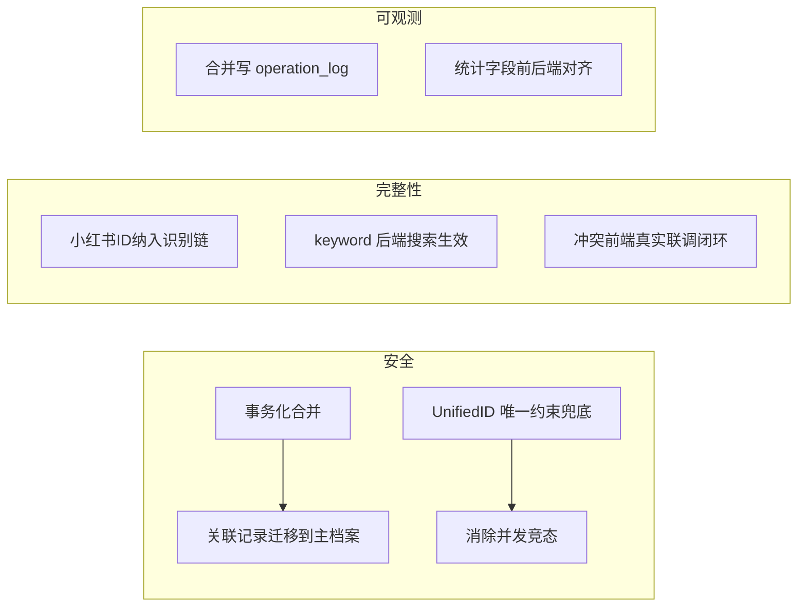

# OneID 体系 — 反复论证与优化方案

> 配套 [oneid-architecture.md](./oneid-architecture.md)。本文基于源码逐点论证现状，指出风险，并给出可落地的优化方案（按优先级排序）。

---

## 论证方法
- 逐文件核对：controller / service / identity / model / repository / 前端 api·view·router。
- 锚点校验：以 `GenerateCustomerUnifiedID` 优先级链、`FindByIdentity` OR 查询、`MergeCustomers` 物理删除为事实基准。
- 端到端视角：从"上报/桥接/Agent 建客 → 识别合并 → 冲突 → 解决 → 列表展示"全链路找断点。

---

## 一、现状论证结论

### ✅ 设计正确的部分
1. **UnifiedID 确定性幂等**：优先级固定 + `BeforeCreate` 钩子，保证同一标识永远收敛到同一 OneID，主档案不会因合并而变 ID。
2. **冲突探测独立落表**：`customer_identity_conflicts` + 审计告警，避免了"静默重复建档"无感知。
3. **规范化前置**：`normalize` 在入库前统一格式（去空格/小写/脱敏掩码），降低脏数据导致的分裂。
4. **API/前端封装完整**：`src/api/oneid.js` 6 个方法签名齐全，路由/菜单已挂载。

### ⚠️ 必须修复的问题（按优先级）

#### P0-1：列表 `keyword` 参数被完全忽略
`ListOneIDCustomers` 中 `_ = keyword`，即搜索语义失效：
```go
func (s *CustomerIdentityService) ListOneIDCustomers(ctx context.Context, page, limit int, keyword string) ([]*model.Customer, int64, error) {
    _ = keyword // ← 参数被丢弃
    ...
}
```
**影响**：前端搜索框无任何后端过滤效果（当前前端用本地桩数据，联调后必然暴露为"搜索无效"）。
**优化**：在 repository 层增加 `keyword` 模糊匹配（phone/email/unified_id LIKE），并透传。

#### P0-2：冲突解决前端为纯桩，未联调
`views/oneid/Conflicts.vue`：
- 表格用硬编码 `conflicts` 常量（conflict_id/unified_id_a/...），**未调用 `fetchConflicts`**。
- "保留主档案/合并到主档案"按钮无 `@click` 后端调用。
- 字段约定与后端 `IdentityConflict`（`identity_type/identity_value/customer_ids/status`）**完全不一致**，即使联调也会字段错位。
**优化**：用 `onMounted(fetchConflicts)` 拉真实数据；表格列对齐后端结构；"合并"按钮调 `mergeCustomers` + `resolveConflict` 闭环。

#### P0-3：列表页前端仍用桩数据
`List.vue`：`sampleCustomers` 常量 + 本地 `localSearch` + 模拟分页，**未调用 `fetchOneIDCustomers/fetchOneIDStats`**。
**优化**：`onMounted` 拉真实列表与统计；搜索改为"后端 keyword + 前端兜底本地过滤"双轨。

#### P1-4：MergeCustomers 物理删除副档案，存在断链风险
当前实现：`Update(primary 回填) → Delete(secondary)`。
**风险**：`session_messages / customer_events / customer_tags / rfm / 触达记录` 仍外键/逻辑指向被删 `secondary.id`，形成孤儿数据，后续 360 视图缺失。
**优化（任选）**：
- A. 合并前将 secondary 关联记录 `UPDATE ... SET customer_id = primary.id`（事务内）。
- B. 软删除（加 `merged_into` 列 + `deleted_at`），保留可追溯。
- 推荐 A + 事务包裹，确保原子性。

#### P1-5：小红书 ID 未纳入 IdentifyOrCreate 识别链
`CustomerIdentityService.IdentifyOrCreate` 仅按 phone/email/wechat/douyin 回填与识别；`xiaohongshu_id` 虽在模型与 `GenerateCustomerUnifiedID` 中存在，但**入参不接收、识别链不消费**。
**优化**：`IdentifyOrCreate` 增加 `xiaohongshuID` 入参，并在回填分支处理该字段（与 douyin 同逻辑）。

#### P1-6：高并发 IdentifyOrCreate 竞态
`FindByIdentity`(OR 查询) 与 `Create` 之间无事务/行锁。两请求同时带同一新手机号 → 均 miss → 双 Create → 唯一索引冲突或两份档案。
**优化**：
- 在 `UnifiedID` 唯一索引冲突时 `ON CONFLICT DO NOTHING` 后回查（upsert 语义）；
- 或 `IdentifyOrCreate` 包事务 + `SELECT ... FOR UPDATE`（针对已存在路径）；新建路径用 DB 唯一约束兜底重试。

### P2-7：OneIDStats 前后端字段错位
后端返回 `with_wechat/with_douyin`，前端仅渲染 `withPhone/withEmail/multiIdentity`；`with_wechat/with_douyin` 在前端未展示。
**优化**：前端补微信/抖音统计卡片，或后端精简为前端实际需要的字段（保持单一事实源）。

### P2-8：MergeCustomers 缺审计与权限
合并是破坏性操作（删客户），当前无操作日志记录、无二次确认后端校验。
**优化**：写入 `operation_log`；Controller 增加"确认令牌"或至少记录操作人。

---

## 二、优化后的目标架构（建议）



---

## 三、落地优先级清单（建议排期）

| 序 | 优化项 | 优先级 | 改动文件 |
|----|--------|--------|----------|
| 1 | 列表 keyword 后端过滤 | P0 | service/customer_identity.go + repository/customer.go |
| 2 | 冲突页真实联调+字段对齐 | P0 | views/oneid/Conflicts.vue |
| 3 | 列表页真实联调 | P0 | views/oneid/List.vue |
| 4 | 合并事务化+关联迁移 | P1 | service/customer_identity.go |
| 5 | 小红书ID纳入识别 | P1 | service/customer_identity.go |
| 6 | 并发竞态兜底 | P1 | service/repository |
| 7 | 统计字段对齐 | P2 | views/oneid/List.vue |
| 8 | 合并审计日志 | P2 | controller + operation_log |

---

## 四、验收判据（端到端）
1. `POST /api/oneid/customers?keyword=138` 真实过滤返回。
2. 冲突页能拉取真实 pending 冲突并执行"合并→标记已解决"闭环。
3. 列表页展示真实客户与统计（非桩）。
4. 合并后，原 secondary 的会话/事件在 primary 360 视图可见。
5. 小红书渠道上报能识别/合并到既有客户。
6. 并发双上报同一新手机号 → 仅产生 1 份档案。
