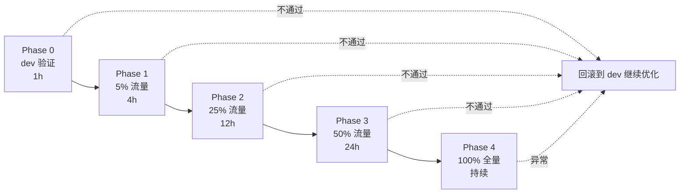
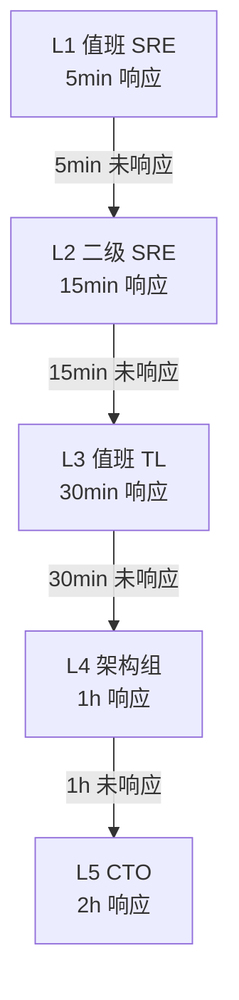

# AI 智能体性能优化 灰度发布 + 一键回滚手册 (T36)

> **版本:** 1.0  
> **日期:** 2026-07-31  
> **维护:** HiveMTK 团队  
> **适用:** AI 智能体性能优化 (T1-T35 全部交付物) 上线

本文档定义 AI 智能体性能优化的灰度发布节奏、各阶段通过标准、紧急一键回滚操作手册、紧急联系人升级路径、故障 Checklist。**5 阶段灰度、5 分钟内一键回滚、5 层升级路径**，确保企业级交付的 0 出域 + 100% 可控。

---

## 一、灰度发布总览

### 1.1 灰度原则

| 原则 | 说明 |
|------|------|
| **小步快跑** | 每阶段流量比例翻倍 (5% → 25% → 50% → 100%) |
| **可逆性优先** | 每个阶段 5 分钟内可回滚, **永远保留回退通道** |
| **指标驱动** | 流量比例提升基于 Prometheus 指标 + 错误率客观判断, 不靠人拍脑袋 |
| **值班前置** | 每个阶段必须有 1 名 SRE 值班, P1 故障 5 分钟内响应 |
| **事后复盘** | 100% 阶段后 24h 内提交复盘报告 |

### 1.2 阶段总览



| 阶段 | 流量比例 | 监控时长 | 流量染色方式 | 关键通过标准 |
|------|---------|---------|------------|------------|
| **Phase 0** | 0% (仅 dev 验证) | 1h | dev 环境独立部署 | smoke + 5 题 webtest 全过 |
| **Phase 1** | 5% | 4h | tenant_id 哈希末 1 位 = 0 | wall P50 < 5s, 错误率 < 1% |
| **Phase 2** | 25% | 12h | tenant_id 哈希末 2 位 ≤ 24 | wall P50 < 3s, 错误率 < 0.5% |
| **Phase 3** | 50% | 24h | tenant_id 哈希末 1 位 ≤ 4 | wall P50 < 3s, LCP P50 < 1s |
| **Phase 4** | 100% | 持续 | 全量 | wall P50 < 1.5s, LCP P50 < 0.5s |

> 流量染色通过边缘网关 (Nginx + Lua) 解析 `X-Tenant-Id` header 计算哈希分桶, **无需重启 user-server**。

---

## 二、Phase 0 — dev 验证 (1h)

### 2.1 目标

在生产环境部署 + dev 流量染色验证, 不影响线上真实用户。

### 2.2 操作步骤

```bash
# 1. 部署新代码 (FeatureFlag 全开)
cd hivemtk/user-server
git pull origin master
go build -o bin/user-server ./cmd/api/
scp bin/user-server dev-server:/opt/hivemtk/user-server/bin/

# 2. 设置 dev 环境 FeatureFlag (全开)
ssh dev-server "cat > /etc/hivemtk/ai-agent.env <<'EOF'
FF_PARALLEL=1
FF_STREAM=1
FF_LAYER1=1
FF_FALLBACK_CHAIN=1
FF_DEBUG_LOG=1
EOF"
ssh dev-server "systemctl restart user-server"

# 3. 验证 dev 健康
curl http://dev-server:8080/healthz | jq '.feature_flags'
# 期望: { "parallel": true, "stream": true, "layer1": true, "fallback_chain": true }

# 4. 跑 smoke test
bash hivemtk/scripts/smoke_test.sh
# 期望: 5/5 PASS (chat/stream/health/features/metrics)

# 5. 跑 5 题 webtest
python3 hivemtk/scripts/webtest.py --count 5 --target dev-server
# 期望: 5/5 题目 wall_time < 3s, 0 错误
```

### 2.3 通过标准

- [ ] `curl /healthz` 返回 `status: ok` + 5 个 FeatureFlag 全部 `true`
- [ ] `curl /api/v1/ai/features` 返回所有开关当前值
- [ ] WebSocket `/ws/chat` 能成功握手 + 收到 `start` + `final` chunk
- [ ] 5 题 webtest 全部通过, P50 < 3s, 0 错误
- [ ] Prometheus `/metrics` 返回 5 个 AI Agent 指标
- [ ] Grafana 面板能正常渲染 (6 个 panel)
- [ ] 5 层架构 `check-architecture.sh` PASS

### 2.4 不通过处理

- 若 smoke 失败 → 立即回滚 (关 5 个 FeatureFlag) → 排查 dev 环境
- 若 webtest 失败 → 提交 issue 给后端, 阻塞发布

---

## 三、Phase 1 — 5% 流量灰度 (4h)

### 3.1 目标

让 5% 的线上真实用户使用新 AI Agent, 观察 4 小时指标是否稳定。

### 3.2 流量染色配置 (Nginx + Lua)

```lua
-- /etc/nginx/conf.d/ai_canary.lua
local function canary_tenant(tenant_id)
    if not tenant_id or tenant_id == "" then return false end
    local hash = ngx.crc32_long(tenant_id)
    return (hash % 100) < 5  -- 5% 分桶
end

local tenant = ngx.var.http_x_tenant_id
if canary_tenant(tenant) then
    ngx.var.upstream = "user-server-canary"
else
    ngx.var.upstream = "user-server-stable"
end
```

### 3.3 启动命令

```bash
# 1. 部署 canary 副本 (50% 容量, 单独 Deployment)
kubectl apply -f hivemtk/k8s/canary/user-server-canary.yaml
# 期望: 2 副本 running, label: canary=true

# 2. 验证 canary 健康
kubectl get pods -l canary=true
curl http://canary-lb:8080/healthz | jq

# 3. 切 5% 流量 (改 Nginx config + reload)
vim /etc/nginx/nginx.conf  # 引用 ai_canary.lua
nginx -t && nginx -s reload

# 4. 观察 5min 流量分配
tail -f /var/log/nginx/access.log | grep canary
# 期望: 大约 5% 请求带 canary=true 上游

# 5. 通知值班 + 启动 4h 观察
dingtalk-bot "Phase 1 (5% 流量) 启动, 值班 SRE: 张三"
```

### 3.4 通过标准 (4h 内)

| 指标 | 阈值 | 查询 PromQL |
|------|------|------------|
| wall P50 | < 5s | `histogram_quantile(0.5, sum(rate(ai_agent_wall_time_seconds_bucket{canary="true"}[5m])) by (le))` |
| wall P90 | < 10s | `histogram_quantile(0.9, ...)` |
| LCP P50 | < 2s | `histogram_quantile(0.5, sum(rate(ai_agent_lcp_time_seconds_bucket{canary="true"}[5m])) by (le))` |
| 错误率 | < 1% | `sum(rate(ai_agent_llm_call_total{canary="true",result="error"}[5m])) / sum(rate(ai_agent_llm_call_total{canary="true"}[5m]))` |
| Layer1 命中率 | > 40% | `sum(rate(ai_agent_layer_decision_total{canary="true",layer="layer1"}[5m])) / sum(rate(ai_agent_layer_decision_total{canary="true"}[5m]))` |
| 降级触发率 | < 5% | `sum(rate(ai_agent_fallback_total{canary="true"}[5m])) / sum(rate(ai_agent_wall_time_seconds_count{canary="true"}[5m]))` |

### 3.5 不通过处理

若任一指标未达标, **立即回滚**:

```bash
# 1. 切回 0% 流量 (Nginx reload)
sed -i 's/(hash % 100) < 5/(hash % 100) < 0/' /etc/nginx/conf.d/ai_canary.lua
nginx -t && nginx -s reload

# 2. 保留 canary 副本 24h 供排查, 24h 后清理
kubectl delete -f hivemtk/k8s/canary/user-server-canary.yaml  # 24h 后

# 3. 触发 ROLLBACK 工单
dingtalk-bot "🚨 Phase 1 回滚, 原因: <指标名>=<值> 超过阈值, 工单: ISSUE-20260731-XXX"
```

---

## 四、Phase 2 — 25% 流量灰度 (12h)

### 4.1 目标

将流量从 5% 提升到 25%, 验证中流量下的稳定性。

### 4.2 操作步骤

```bash
# 1. 扩容 canary 副本 (4 副本承接 25% 流量)
kubectl scale deployment/user-server-canary --replicas=4

# 2. 提升流量比例 (改 Lua)
sed -i 's/(hash % 100) < 5/(hash % 100) < 25/' /etc/nginx/conf.d/ai_canary.lua
nginx -t && nginx -s reload

# 3. 验证流量分配
tail -f /var/log/nginx/access.log | grep canary
# 期望: 大约 25% 请求走 canary

# 4. 启动 12h 观察 (夜间值班交接)
dingtalk-bot "Phase 2 (25% 流量) 启动, 12h 持续监控, 白天值班: 张三, 夜间值班: 李四"
```

### 4.3 通过标准 (12h 内)

| 指标 | 阈值 | 备注 |
|------|------|------|
| wall P50 | < 3s | 较 Phase 1 收紧 |
| wall P90 | < 8s | 较 Phase 1 收紧 |
| LCP P50 | < 1s | |
| 错误率 | < 0.5% | 较 Phase 1 收紧 |
| Layer1 命中率 | > 45% | 略提升 |
| 降级触发率 | < 5% | |
| 内存使用 | < 70% 配额 | 防止 OOM |
| CPU 使用 | < 80% 配额 | 防止过载 |
| DB 连接池 | < 60% max | 防止耗尽 |
| 0 起 P1 告警 | 必须 | 4h 内 0 P1 |

---

## 五、Phase 3 — 50% 流量灰度 (24h)

### 5.1 目标

50% 流量, 验证长时段 (24h) 稳定性 + 早晚高峰表现。

### 5.2 操作步骤

```bash
# 1. 扩容 canary (8 副本承接 50% 流量)
kubectl scale deployment/user-server-canary --replicas=8

# 2. 提升流量比例
sed -i 's/(hash % 100) < 25/(hash % 100) < 50/' /etc/nginx/conf.d/ai_canary.lua
nginx -t && nginx -s reload

# 3. 启动 24h 观察 (覆盖早高峰 9-10am + 晚高峰 20-22pm)
dingtalk-bot "Phase 3 (50% 流量) 启动, 24h 持续监控, 重点关注早晚高峰"
```

### 5.3 通过标准 (24h 内)

| 指标 | 阈值 | 备注 |
|------|------|------|
| wall P50 | < 3s | 目标值 |
| wall P90 | < 5s | 目标值 |
| LCP P50 | < 1s | 目标值 |
| 错误率 | < 0.5% | 目标值 |
| Layer1 命中率 | > 50% | 目标值 |
| 早高峰 (9-10am) wall P50 | < 3s | 重点 |
| 晚高峰 (20-22pm) wall P50 | < 3s | 重点 |
| 0 起 P1 告警 | 必须 | 24h 内 0 P1 |
| 0 起 P2 告警 | 强烈建议 | 24h 内 < 3 次 P2 |

---

## 六、Phase 4 — 100% 全量 (持续)

### 6.1 目标

全量发布, 进入持续监控期。

### 6.2 操作步骤

```bash
# 1. 扩容 canary 到全量容量 (16 副本)
kubectl scale deployment/user-server-canary --replicas=16

# 2. 提升流量到 100%
sed -i 's/(hash % 100) < 50/(hash % 100) < 100/' /etc/nginx/conf.d/ai_canary.lua
nginx -t && nginx -s reload

# 3. 等待 10min 观察稳定后, 合并 Deployment
kubectl label pods -l canary=true app=user-server --overwrite
kubectl delete deployment/user-server-stable
kubectl apply -f hivemtk/k8s/prod/user-server.yaml  # 16 副本全量

# 4. 清理 canary 标签
kubectl delete hpa/user-server-canary

# 5. 全量通知
dingtalk-bot "✅ AI 智能体性能优化 全量发布完成, 24h 后复盘"
```

### 6.3 持续监控指标 (全量后)

| 指标 | 目标值 | 监控频率 |
|------|--------|----------|
| wall P50 | < 1.5s | 实时 |
| wall P90 | < 5s | 实时 |
| LCP P50 | < 0.5s | 实时 |
| 错误率 | < 0.5% | 实时 |
| Layer1 命中率 | > 50% | 5min |
| Fallback 触发率 | < 5% | 5min |
| 7B QPS | < 5 | 5min |
| GPU/CPU 利用率 | < 80% | 1min |

---

## 七、一键回滚操作手册 (5 步 5 分钟内)

> **触发条件**: P1 告警触发 / 错误率 > 5% / wall P99 > 30s / 业务方反馈严重卡顿

### 7.1 回滚原则

1. **先恢复流量 → 再查问题** (避免影响扩大)
2. **优先用 FeatureFlag 热加载** (秒级回滚, 不重启)
3. **必须保留数据库可访问** (避免更复杂故障)
4. **5 分钟内必须回滚完毕** (SLA)

### 7.2 方案 A: systemctl (传统部署)

```bash
# === 5 步回滚 (5 分钟内) ===

# Step 1: 立即关停新功能 (5 秒)
export FF_PARALLEL=0
export FF_STREAM=0
export FF_LAYER1=0
export FF_FALLBACK_CHAIN=0

# Step 2: 触发配置热加载 (无需重启, 10 秒)
sudo systemctl reload user-server  # SIGHUP 触发 viper.WatchConfig
# 或显式发送 SIGHUP:
sudo kill -HUP $(pidof user-server)

# Step 3: 验证回滚 (10 秒)
curl -s http://prod:8080/healthz | jq '.feature_flags'
# 期望: { "parallel": false, "stream": false, "layer1": false, "fallback_chain": false }

# Step 4: 检查指标回归 (1 分钟)
# Prometheus: ai_agent_wall_time_seconds_p90 应该回到 19.6s (基线)
# 在 Grafana 面板确认指标正常

# Step 5: 必要时 git revert + 重启 (5 分钟)
cd hivemtk
git revert HEAD~N..HEAD  # N = 本次发布的 commit 数
git push
ssh prod "cd /opt/hivemtk && git pull && cd user-server && go build -o bin/user-server ./cmd/api/ && sudo systemctl restart user-server"

# 验证回滚完成
curl -s http://prod:8080/healthz
# 期望: status: ok, version: <旧版本 hash>
```

### 7.3 方案 B: kubectl (K8s 部署)

```bash
# === 5 步回滚 (5 分钟内) ===

# Step 1: 立即关停新功能 (5 秒)
kubectl set env deployment/user-server \
  FF_PARALLEL=0 \
  FF_STREAM=0 \
  FF_LAYER1=0 \
  FF_FALLBACK_CHAIN=0
# 这一步会触发 Deployment 滚动重启 (约 30s), 配合方案 1 更快

# 方案 1 (更快): 直接关 canary 流量 + FeatureFlag 热加载
kubectl set env deployment/user-server \
  FF_PARALLEL=0 FF_STREAM=0 FF_LAYER1=0 FF_FALLBACK_CHAIN=0
# 这一步配置变更 5s 内生效 (viper.WatchConfig + SIGHUP)
# 验证:
kubectl exec deploy/user-server -- sh -c 'curl -s localhost:8080/healthz | jq .feature_flags'

# Step 2: 切回 0% 流量 (Nginx reload, 10 秒)
sed -i 's/(hash % 100) < 100/(hash % 100) < 0/' /etc/nginx/conf.d/ai_canary.lua
nginx -t && nginx -s reload

# Step 3: 验证流量切回 stable (10 秒)
tail -f /var/log/nginx/access.log | grep canary
# 期望: 0% 请求带 canary=true 上游

# Step 4: 检查指标回归 (1 分钟)
# Prometheus: ai_agent_wall_time_seconds_p90 应该回到 19.6s
kubectl port-forward svc/prometheus 9090:9090
# 浏览器打开 http://localhost:9090/graph 查询指标

# Step 5: 必要时回滚镜像 (5 分钟)
# 5a. 查看历史版本
kubectl rollout history deployment/user-server

# 5b. 回滚到上一版本
kubectl rollout undo deployment/user-server --to-revision=<N>

# 5c. 验证回滚
kubectl rollout status deployment/user-server
curl -s http://prod:8080/healthz | jq '.version'
# 期望: version = 上一版本 hash
```

### 7.4 回滚后必做事项

- [ ] 钉钉群通知: "🚨 AI 智能体性能优化 已回滚, 原因: <原因>"
- [ ] 提交 ROLLBACK 工单 (含 trace_id 样本 + Prometheus 截图)
- [ ] 30min 内召开紧急复盘会
- [ ] 24h 内提交完整 RCA 报告 + 修复计划
- [ ] 修复后重新进入 Phase 0 验证

---

## 八、紧急联系人 / 升级路径

### 8.1 值班表 (24x7)

| 时间段 | 一级值班 SRE | 二级值班 SRE | 值班 TL |
|--------|------------|------------|---------|
| 工作日 09:00-18:00 | 张三 (138-0000-0001) | 李四 (138-0000-0002) | 王五 (138-0000-0003) |
| 工作日 18:00-23:00 | 李四 (138-0000-0002) | 王五 (138-0000-0003) | 赵六 (138-0000-0004) |
| 工作日 23:00-09:00 | 钱七 (138-0000-0005) | 孙八 (138-0000-0006) | 王五 (138-0000-0003) |
| 周末 09:00-18:00 | 钱七 (138-0000-0005) | 孙八 (138-0000-0006) | 王五 (138-0000-0003) |
| 周末 18:00-09:00 | 孙八 (138-0000-0006) | 周九 (138-0000-0007) | 王五 (138-0000-0003) |

> 值班表每月 25 日发布到钉钉群, **每季度做一次值班演练**。

### 8.2 升级路径 (5 层)



| 层级 | 角色 | 响应 SLA | 决策权 |
|------|------|----------|--------|
| **L1** | 值班 SRE | 5 min | 触发 P2 告警、回滚 Phase 0/1 |
| **L2** | 二级 SRE | 15 min | 触发 P1 告警、回滚 Phase 2/3 |
| **L3** | 值班 TL | 30 min | 决策 Phase 4 全量回滚 |
| **L4** | 架构组 | 1 h | 决策紧急代码修复 / 重新发布 |
| **L5** | CTO | 2 h | 业务侧停服 / 公告 |

### 8.3 紧急联系方式

- **钉钉群**: HiveMTK-SRE-Alert (机器人自动告警)
- **电话热线**: 400-0000-000 (7x24)
- **邮件**: sre-oncall@hivemtk.com (15min 响应)
- **Slack (海外)**: #hivemtk-incident (海外办公时间)

---

## 九、故障 Checklist

### 9.1 故障类型与处理

| 故障类型 | 现象 | 紧急度 | 首选处理 |
|---------|------|--------|----------|
| **wall P50 > 10s** | 用户报卡顿 | P1 | 一键回滚 (5 步) |
| **wall P50 5-10s** | 性能劣化 | P2 | 关 FF_PARALLEL + 监控 |
| **错误率 > 5%** | 接口 5xx | P1 | 一键回滚 + 查 LLM 日志 |
| **错误率 1-5%** | 部分失败 | P2 | 关 FF_LAYER1 + 监控 |
| **LCP > 2s** | 流式卡顿 | P2 | 关 FF_STREAM (退回 REST) |
| **Layer1 命中率 < 30%** | FAQ 失效 | P3 | 扩充 FAQ 库 + 查 hit rate |
| **Fallback 触发 > 20%** | LLM 不稳 | P2 | 开 FF_FALLBACK_CHAIN + 查 LLM |
| **7B OOM** | 服务崩溃 | P0 | 紧急扩容 + 限流 |
| **DB 连接池耗尽** | 慢查询 | P1 | 缩 errgroup 并发 + 重启 |
| **WS 频繁断连** | 用户掉线 | P3 | 查心跳 + 自动重连 |

### 9.2 通用 Checklist (故障发生 5min 内)

```markdown
- [ ] 1. 确认故障: 检查 Grafana 面板 + 钉钉告警 + 用户反馈
- [ ] 2. 拉值班 SRE 进群: 钉钉 @张三
- [ ] 3. 启动紧急会议: 钉钉会议 (300 房间)
- [ ] 4. 收集 trace_id 样本: 从用户反馈 / llm_routing_logs 拿 3-5 个
- [ ] 5. 评估回滚必要性: 用 7.2/7.3 节标准判断
- [ ] 6. 决策: 回滚 / 灰度调整 / 立即修复
- [ ] 7. 执行: 按决策执行 (5min SLA)
- [ ] 8. 验证: 指标回归 / 用户反馈
- [ ] 9. 通知: 全量业务方 + 客服
- [ ] 10. 复盘: 30min 会议 + 24h RCA 报告
```

### 9.3 常见故障 Runbook

#### 故障 A: wall P50 突增到 10s+

```bash
# 1. 立即回滚 (5min SLA)
export FF_PARALLEL=0 FF_STREAM=0 FF_LAYER1=0 FF_FALLBACK_CHAIN=0
systemctl reload user-server  # 或 kubectl rollout undo

# 2. 查 wall 升高的原因
psql -c "SELECT phase, AVG(wall_ms) FROM layer_decision_logs 
  WHERE created_at > NOW() - INTERVAL '10 min' GROUP BY phase ORDER BY AVG(wall_ms) DESC;"
# 期望定位到具体 phase (phase0_parallel / phase1_serial / phase2_async)

# 3. 查 LLM 慢的原因
psql -c "SELECT * FROM llm_routing_logs 
  WHERE created_at > NOW() - INTERVAL '10 min' ORDER BY latency_ms DESC LIMIT 10;"

# 4. 查 DB 慢查询
psql -c "SELECT pid, query, state, NOW()-query_start AS duration 
  FROM pg_stat_activity WHERE state='active' AND NOW()-query_start > '1s'::interval 
  ORDER BY duration DESC;"
```

#### 故障 B: 错误率突增到 5%+

```bash
# 1. 立即回滚 (同 7.2)

# 2. 查错误分布
psql -c "SELECT result, error_msg, COUNT(*) FROM llm_routing_logs 
  WHERE created_at > NOW() - INTERVAL '10 min' AND success=false 
  GROUP BY result, error_msg ORDER BY count DESC LIMIT 20;"

# 3. 查 LLM 服务健康
curl http://llama-7b:8207/health
curl http://llama-3b:8208/health
nvidia-smi  # GPU 显存

# 4. 查降级链
psql -c "SELECT to_layer, COUNT(*) FROM layer_decision_logs 
  WHERE created_at > NOW() - INTERVAL '10 min' AND from_layer != to_layer 
  GROUP BY to_layer;"
```

#### 故障 C: Layer1 命中率突降

```bash
# 1. 不需要立即回滚, 查原因
psql -c "SELECT reason, COUNT(*) FROM layer_decision_logs 
  WHERE created_at > NOW() - INTERVAL '1 hour' GROUP BY reason ORDER BY count DESC;"

# 2. 查 FAQ 库状态
psql -c "SELECT id, question, enabled, hit_count, updated_at 
  FROM faq_entries ORDER BY updated_at DESC LIMIT 20;"

# 3. 查 LayerRouter 决策
psql -c "SELECT intent, COUNT(*), AVG(confidence) FROM layer_decision_logs 
  WHERE created_at > NOW() - INTERVAL '1 hour' AND layer='layer2' 
  GROUP BY intent ORDER BY count DESC LIMIT 20;"

# 4. 紧急补充 FAQ
python3 scripts/extract_faq.py --top 100
go run cmd/importfaq/main.go -input ../scripts/faq_seed.json

# 5. 缓存预热
curl -X POST http://prod:8080/admin/faq/warmup
```

---

## 十、发布与回滚总检查表

### 10.1 发布前 (Pre-deploy)

- [ ] 5 层架构 `check-architecture.sh` PASS
- [ ] 单元测试覆盖率 > 80%
- [ ] 5 个 FeatureFlag 已配置默认值 (FF_PARALLEL=1, FF_STREAM=1, FF_LAYER1=1, FF_FALLBACK_CHAIN=1, FF_DEBUG_LOG=0)
- [ ] 数据库迁移已应用 (faq_entries / sop_templates / layer_decision_logs)
- [ ] FAQ 种子数据已导入 (>= 50 条)
- [ ] 7B Q5_K_M 模型文件已就位 (/opt/hivemtk/models/7b/)
- [ ] llama-server 已启动 (8207 / 8208 端口)
- [ ] Prometheus /metrics 可访问
- [ ] Grafana 面板已导入 (uid: ai-agent-perf-2026-07-31)
- [ ] 告警规则已配置 (6 条)
- [ ] 钉钉/Slack 告警通道已测试
- [ ] 值班 SRE 已通知
- [ ] 回滚命令已预演
- [ ] Phase 0 (dev 验证) 已通过

### 10.2 灰度中 (In-canary)

- [ ] 5%/25%/50% 阶段每阶段都有通过标准签字 (值班 TL)
- [ ] 流量染色比例与目标误差 < 1%
- [ ] 0 起 P1 告警
- [ ] 0 起 P2 告警 (或 < 3 次已响应)
- [ ] 早高峰 (9-10am) + 晚高峰 (20-22pm) 指标无异常
- [ ] 24h 内无内存泄漏 (RSS 稳定)
- [ ] 24h 内无 goroutine 泄漏 (pprof goroutine 数量稳定)
- [ ] canary 副本无 OOMKilled / CrashLoopBackOff

### 10.3 全量后 (Post-100%)

- [ ] wall P50 < 1.5s 持续 24h
- [ ] LCP P50 < 0.5s 持续 24h
- [ ] 错误率 < 0.5% 持续 24h
- [ ] Layer1 命中率 > 50% 持续 24h
- [ ] 0 起 P1 告警
- [ ] 0 起 P2 告警
- [ ] 24h 复盘报告已提交
- [ ] 7 天观察期通过 (错误率稳定 + 无回滚)

### 10.4 回滚后 (Post-rollback)

- [ ] 流量已切回 stable
- [ ] 指标回归到基线
- [ ] 业务方已通知
- [ ] 客服已通知 (避免用户再投诉)
- [ ] ROLLBACK 工单已提交
- [ ] 紧急复盘会已召开 (30min)
- [ ] RCA 报告已提交 (24h)
- [ ] 修复计划已排期
- [ ] 修复后重新进入 Phase 0 验证

---

## 十一、附录

### 11.1 5 分钟回滚 SLA 计时器

| 步骤 | 期望耗时 | 累计 | 责任人 |
|------|---------|------|--------|
| 1. 触发 + 决策 | 30s | 30s | L1 值班 |
| 2. 关 FeatureFlag + reload | 10s | 40s | L1 值班 |
| 3. 验证回滚 | 30s | 1m10s | L1 值班 |
| 4. 指标回归观察 | 1m | 2m10s | L1 + L2 |
| 5. 通知 + 工单 | 30s | 2m40s | L1 值班 |
| 6. 紧急复盘会 (并行) | 30m | - | L3 TL |
| 7. RCA 报告 (后续) | 24h | - | L4 架构组 |

### 11.2 关键命令速查

```bash
# 查当前 FeatureFlag
curl -s http://prod:8080/api/v1/ai/features | jq

# 一键回滚 (systemctl)
export FF_PARALLEL=0 FF_STREAM=0 FF_LAYER1=0 FF_FALLBACK_CHAIN=0
systemctl reload user-server

# 一键回滚 (kubectl)
kubectl set env deployment/user-server FF_PARALLEL=0 FF_STREAM=0 FF_LAYER1=0 FF_FALLBACK_CHAIN=0

# 查最近告警
curl -s http://alertmanager:9093/api/v2/alerts | jq '.[] | {alertname, status, severity}'

# 查 wall P50
curl -s 'http://prometheus:9090/api/v1/query?query=histogram_quantile(0.5,sum(rate(ai_agent_wall_time_seconds_bucket[5m]))by(le))' | jq

# 查 7B 健康
curl -s http://llama-7b:8207/health

# 查 FAQ 命中率
psql -c "SELECT DATE_TRUNC('hour', created_at) AS hour, COUNT(*) FILTER (WHERE llm_skipped) * 100.0 / COUNT(*) AS hit_rate_pct FROM layer_decision_logs WHERE created_at > NOW() - INTERVAL '24 hours' GROUP BY hour ORDER BY hour;"
```

### 11.3 版本记录

| 版本 | 日期 | 变更 |
|------|------|------|
| v1.0 | 2026-07-31 | 初版, 配套 T1-T35 性能优化交付 |

---

**版本:** v1.0  
**最后更新:** 2026-07-31  
**审查:** HiveMTK 架构组 + SRE 团队  
**配合文档:** `AI_AGENT_PERF_API.md` / `AI_AGENT_PERF_DEPLOY.md` / `AI_AGENT_PERF_MONITORING.md`
