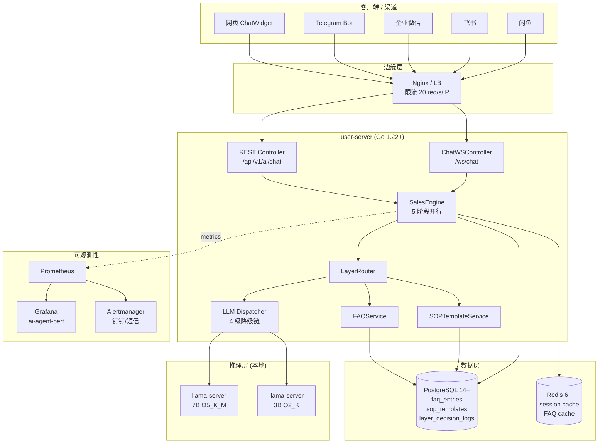

# AI 智能体性能优化 部署文档

> **版本:** 1.0  
> **日期:** 2026-07-31  
> **维护:** HiveMTK 团队

本文档描述企业级 AI 智能体性能优化（5 阶段并行 + 双层架构 + WebSocket 流式）的部署步骤、灰度发布节奏和紧急回滚方案。

---

## 一、部署前置

### 1.1 部署架构图 (mermaid)



### 1.2 环境要求

| 组件 | 最低版本 | 推荐版本 |
|------|----------|----------|
| Go | 1.22+ | 1.22+ |
| PostgreSQL | 14+ | 16+ |
| Redis | 6+ | 7+ |
| llama.cpp | b3000+ | latest |
| 内存 | 16GB (开发) | 32GB+ (生产) |
| CPU | 8 核 (开发) | 16 核+ (生产) |
| 磁盘 | 50GB | 200GB+ (含模型) |

#### 1.2.1 LLM 模型文件要求

| 模型 | 用途 | 量化 | 文件名 | 大小 | 路径 |
|------|------|------|--------|------|------|
| **7B 主模型** | 默认推理 | **Q5_K_M** | `qwen2-7b-instruct-q5_k_m.gguf` | ~5.5GB | `/opt/hivemtk/models/7b/` |
| 3B 降级模型 | Fallback 链第二级 | Q2_K | `qwen2-1_5b-instruct-q2_k.gguf` (示例) | ~1.2GB | `/opt/hivemtk/models/3b/` |
| Embedding (可选) | FAQ 向量召回 | FP16 | `bge-small-zh-v1.5.gguf` | ~90MB | `/opt/hivemtk/models/embed/` |

**7B Q5_K_M 模型下载 (HuggingFace / ModelScope)：**

```bash
# 方式 1: HuggingFace
mkdir -p /opt/hivemtk/models/7b
cd /opt/hivemtk/models/7b
wget https://huggingface.co/Qwen/Qwen2-7B-Instruct-GGUF/resolve/main/qwen2-7b-instruct-q5_k_m.gguf

# 方式 2: ModelScope (国内更快)
pip install modelscope
python3 -c "
from modelscope import snapshot_download
snapshot_download('qwen/Qwen2-7B-Instruct-GGUF',
                  allow_patterns=['*q5_k_m.gguf'],
                  cache_dir='/opt/hivemtk/models/7b')
"
```

**llama-server 启动：**

```bash
# 7B Q5_K_M (生产)
llama-server \
  --model /opt/hivemtk/models/7b/qwen2-7b-instruct-q5_k_m.gguf \
  --port 8207 \
  --ctx-size 4096 \
  --n-gpu-layers 35 \
  --threads 8 \
  --host 0.0.0.0

# 3B Q2_K (降级)
llama-server \
  --model /opt/hivemtk/models/3b/qwen2-1_5b-instruct-q2_k.gguf \
  --port 8208 \
  --ctx-size 2048 \
  --n-gpu-layers 0 \
  --threads 4 \
  --host 0.0.0.0
```

### 1.3 FeatureFlag 默认值

5 个开关默认值（性能优化全开，调试日志关闭）：

| 开关 | 默认值 | 说明 |
|------|--------|------|
| `FF_PARALLEL` | `1` | 启用 5 阶段并行化 |
| `FF_STREAM` | `1` | 启用 WebSocket 流式输出 |
| `FF_LAYER1` | `1` | 启用 Layer1 FAQ/SOP SkipLLM |
| `FF_FALLBACK_CHAIN` | `1` | 启用 4 级降级链 |
| `FF_DEBUG_LOG` | `0` | 关闭 phase 详细日志（生产默认关闭） |

> **部署时建议**: 先按默认全开部署, 然后通过灰度发布 + FeatureFlag 验证。如需全量回退旧版, 5 个开关全置 0 即可。

### 1.4 代码要求

- ✅ 5 层架构零违规 (`bash hivemtk/scripts/check-architecture.sh`)
- ✅ 单元测试覆盖率 > 80%
- ✅ `go vet ./... && staticcheck ./...` 零警告
- ✅ `go build ./...` 零错误

---

## 二、部署步骤

### 2.1 数据库迁移

```bash
# 1. 备份
pg_dump -h $PG_HOST -U $PG_USER user_db > backup_pre_aiperf_$(date +%Y%m%d).sql

# 2. 应用迁移 (新增 3 表)
cd hivemtk/user-server
go run cmd/migrate/main.go up

# 3. 验证
psql -h $PG_HOST -U $PG_USER user_db -c "\dt faq_entries"
psql -h $PG_HOST -U $PG_USER user_db -c "\dt sop_templates"
psql -h $PG_HOST -U $PG_USER user_db -c "\dt layer_decision_logs"
```

### 2.2 FAQ 数据导入

```bash
# 1. 提取 FAQ 种子
python3 scripts/extract_faq.py
# 输出: scripts/faq_seed.json (50 条)

# 2. 干跑 (不写 DB)
cd hivemtk/user-server
go run cmd/importfaq/main.go \
  -input ../scripts/faq_seed.json \
  -dry-run

# 3. 实际导入
go run cmd/importfaq/main.go \
  -input ../scripts/faq_seed.json

# 4. 验证
psql -h $PG_HOST -U $PG_USER user_db \
  -c "SELECT count(*), intent FROM faq_entries WHERE enabled=true GROUP BY intent;"
```

### 2.3 服务部署

```bash
# 1. 编译
cd hivemtk/user-server
go build -o bin/user-server ./cmd/api/

# 2. 复制二进制
scp bin/user-server user@prod:/opt/hivemtk/user-server/bin/

# 3. 重启服务 (FeatureFlag 全关闭状态, 与旧版行为一致)
ssh user@prod "systemctl restart user-server"

# 4. 验证健康
curl http://prod:8080/healthz | jq
# 期望: {"status":"ok","feature_flags":{"parallel":false,...}}
```

### 2.4 Prometheus 接入

```yaml
# prometheus.yml
scrape_configs:
  - job_name: 'hivemtk-user-server'
    static_configs:
      - targets: ['prod:8080']
    metrics_path: '/metrics'
    scrape_interval: 15s
```

### 2.5 Grafana 面板导入

```bash
# 导入面板 JSON
curl -X POST http://grafana:3000/api/dashboards/import \
  -H "Content-Type: application/json" \
  -d @docs/operations/grafana/ai-agent-perf.json
```

---

## 三、灰度发布

### 3.1 灰度节奏

| 阶段 | 比例 | 监控时长 | 通过标准 | 回滚条件 |
|------|------|---------|---------|---------|
| **Phase 0** | 0% (仅 dev) | 1h | smoke test + 5 题 webtest 通过 | 任何错误率 > 1% |
| **Phase 1** | 5% | 4h | wall P50 < 5s, 错误率 < 1% | wall P50 > 8s 持续 30min |
| **Phase 2** | 25% | 12h | wall P50 < 3s, 错误率 < 0.5% | wall P50 > 5s 持续 1h |
| **Phase 3** | 50% | 24h | wall P50 < 3s, LCP P50 < 1s | LCP P50 > 2s 持续 1h |
| **Phase 4** | 100% | 持续 | wall P50 < 1.5s, LCP P50 < 0.5s | 任意告警触发 |

### 3.2 灰度命令

```bash
# Phase 1 (5% 流量)
export FF_LAYER1=1
export FF_PARALLEL=0   # 先开 Layer1, 观察 P50
export FF_STREAM=0
systemctl reload user-server

# Phase 2 (加 Parallel)
export FF_PARALLEL=1
systemctl reload user-server

# Phase 3 (加 Stream)
export FF_STREAM=1
systemctl reload user-server
```

### 3.3 监控指标 (灰度期)

| 指标 | 命令 | 通过值 |
|------|------|--------|
| wall P50 | `prometheus_query('histogram_quantile(0.5, ai_agent_wall_time_seconds_bucket)')` | < 3s |
| wall P90 | `histogram_quantile(0.9, ...)` | < 5s |
| LCP P50 | `histogram_quantile(0.5, ai_agent_lcp_time_seconds_bucket)` | < 1s |
| Layer1 命中率 | `rate(ai_agent_layer_decision_total{layer="layer1"}[5m]) / rate(ai_agent_layer_decision_total[5m])` | > 50% |
| LLM 错误率 | `rate(ai_agent_llm_call_total{result="error"}[5m]) / rate(ai_agent_llm_call_total[5m])` | < 1% |

---

## 四、紧急回滚

### 4.1 5 步回滚（5 分钟内）

```bash
# Step 1: 立即关停新功能 (5 秒)
export FF_PARALLEL=0
export FF_STREAM=0
export FF_LAYER1=0
export FF_FALLBACK_CHAIN=0

# Step 2: 触发配置热加载 (无需重启)
systemctl reload user-server  # 通过 SIGHUP 触发 viper.WatchConfig

# Step 3: 验证回滚 (10 秒)
curl -s http://prod:8080/healthz | jq '.feature_flags'
# 期望: { "parallel": false, "stream": false, "layer1": false }

# Step 4: 检查指标回归 (1 分钟)
# Prometheus: ai_agent_wall_time_seconds_p90 应该回到 19.6s (基线)

# Step 5: 必要时 git revert (5 分钟)
git revert HEAD~N..HEAD
git push
kubectl rollout undo deployment/user-server
```

### 4.2 紧急回滚判断标准

**立即回滚 (P1)**:
- wall P50 > 10s 持续 5min
- 错误率 > 5% 持续 5min
- LCP P99 > 5s 持续 5min
- 出现数据库连接池耗尽 (pg_stat_activity > 90% max)

**延迟回滚 (P2)**:
- wall P50 > 5s 持续 30min
- Layer1 命中率 < 30% (未达预期)
- Fallback 触发率 > 20%

### 4.3 回滚演练

每季度做一次回滚演练：

```bash
# 1. 制造回滚场景 (临时开启 FF_FALLBACK_CHAIN=1 模拟故障)
# 2. 执行回滚命令
# 3. 验证 wall time 回到 19.6s (基线)
# 4. 提交演练报告
```

---

## 五、扩容与性能调优

### 5.1 水平扩容

```bash
# 单实例 QPS 容量 (本地 7B CPU 推理)
# - 串行模式: ~3 QPS
# - 5 阶段并行: ~12 QPS
# - 双层架构 (50% 命中): ~24 QPS

# 容量规划: 100 QPS 需 4-8 实例
kubectl scale deployment/user-server --replicas=8
```

### 5.2 数据库连接池

```yaml
# config.yaml
database:
  max_open_conns: 50      # 默认 25, 并行化后建议 50
  max_idle_conns: 10
  conn_max_lifetime: 3600 # 1h
```

### 5.3 LLM 推理参数

```yaml
# config.yaml
inference:
  llm:
    timeout_seconds: 180  # 默认 180s, 开发模式可设 720s
    max_tokens: 1024      # 7B Q5 优化建议 1024 (节省 30% 时间)
    temperature: 0.7
```

### 5.4 FAQ 命中率优化

- **种子质量**: 提取 Top 50 高频问答 → 1 周后扩展到 200 条
- **关键词人工标注**: 运营标注 keywords 数组 (5-10 个)
- **Embedding 增强**: 接入 BGE Embedding 做相似度召回 (Phase 2 优化)
- **A/B 测试**: 新增 FAQ 走 5% 灰度, 观察 hit rate + 转化率

---

## 六、监控告警清单

### 6.1 告警规则 (推荐)

```yaml
# alerts.yml
groups:
  - name: ai_agent_perf
    rules:
      - alert: AIWallTimeP90High
        expr: histogram_quantile(0.9, ai_agent_wall_time_seconds_bucket) > 10
        for: 5m
        labels: { severity: P2 }
        annotations:
          summary: "AI agent wall time P90 超过 10s"

      - alert: AIWallTimeP50High
        expr: histogram_quantile(0.5, ai_agent_wall_time_seconds_bucket) > 5
        for: 10m
        labels: { severity: P2 }

      - alert: AILCPTimeP99High
        expr: histogram_quantile(0.99, ai_agent_lcp_time_seconds_bucket) > 2
        for: 5m
        labels: { severity: P1 }

      - alert: AILayer1HitRateLow
        expr: |
          rate(ai_agent_layer_decision_total{layer="layer1"}[30m]) /
          rate(ai_agent_layer_decision_total[30m]) < 0.5
        for: 30m
        labels: { severity: P3 }

      - alert: AIFallbackRateHigh
        expr: rate(ai_agent_fallback_total[10m]) > 0.2
        for: 10m
        labels: { severity: P2 }

      - alert: AILLMErrorRateHigh
        expr: |
          rate(ai_agent_llm_call_total{result="error"}[5m]) /
          rate(ai_agent_llm_call_total[5m]) > 0.05
        for: 5m
        labels: { severity: P1 }
```

### 6.2 通知渠道

| 告警级别 | 渠道 | 响应时间 |
|---------|------|----------|
| P1 | 钉钉@值班 + 短信 | 5 分钟 |
| P2 | 钉钉群 | 30 分钟 |
| P3 | 邮件 + 钉钉群 | 4 小时 |

---

## 七、故障排查

### 7.1 wall time 升高

```bash
# 1. 检查 FeatureFlag 状态
curl -s http://prod:8080/healthz | jq '.feature_flags'

# 2. 检查 LLM 服务
curl -s http://localhost:8207/health  # llama-server

# 3. 检查 Phase 0 耗时
psql -c "SELECT AVG(wall_ms) FROM layer_decision_logs WHERE created_at > NOW() - INTERVAL '5 min' GROUP BY layer;"

# 4. 检查 DB 连接池
psql -c "SELECT count(*) FROM pg_stat_activity WHERE datname='user_db';"
```

### 7.2 Layer1 命中率低

```bash
# 1. 检查 FAQ 库数据量
psql -c "SELECT count(*) FROM faq_entries WHERE enabled=true;"

# 2. 检查意图分布
psql -c "SELECT reason, count(*) FROM layer_decision_logs WHERE created_at > NOW() - INTERVAL '1 hour' GROUP BY reason;"

# 3. 补充 FAQ 种子
python3 scripts/extract_faq.py --top 100
go run cmd/importfaq/main.go -input ../scripts/faq_seed.json
```

### 7.3 LLM 持续超时

```bash
# 1. 检查 LLM 服务负载
curl -s http://localhost:8207/metrics | grep slots

# 2. 临时启用 4 级降级
export FF_FALLBACK_CHAIN=1
systemctl reload user-server

# 3. 检查降级链是否生效
psql -c "SELECT to_layer, count(*) FROM layer_decision_logs WHERE created_at > NOW() - INTERVAL '5 min' AND from_layer != to_layer GROUP BY to_layer;"
```

---

## 八、升级检查清单 (Pre-deploy)

- [ ] PG 备份完成
- [ ] 5 层架构 check 通过
- [ ] 单元测试覆盖率 > 80%
- [ ] FAQ 种子数据导入
- [ ] Prometheus 配置更新
- [ ] Grafana 面板导入
- [ ] 告警规则配置
- [ ] 灰度比例设定
- [ ] 回滚命令就绪
- [ ] 团队通知发送

---

**版本:** v1.0  
**最后更新:** 2026-07-31  
**审查:** HiveMTK 架构组
