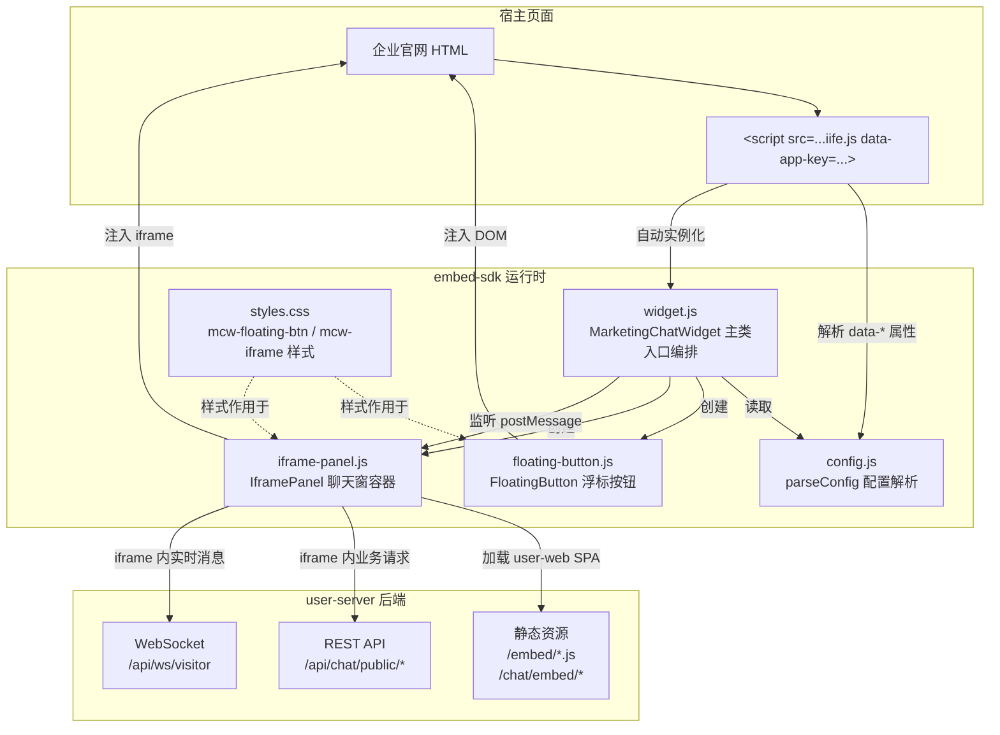
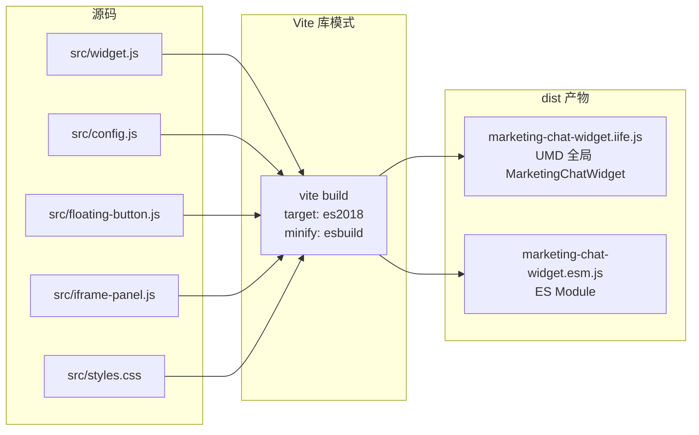

# embed-sdk 架构图

> **规则级别**: ⭐⭐ 项目级开发文档

> 本文档描述 marketing-chat-widget(embed-sdk) 的整体架构、嵌入时序、与 user-server 的通信链路、跨域安全模型与浏览器兼容性矩阵。
> 关联文档：[../../README.md](../../README.md)、[../../../docs/operations/CHAT_WIDGET_EMBED.md](../../../docs/operations/CHAT_WIDGET_EMBED.md)、[../../../docs/architecture/adr/ADR-011-chat-widget-embed.md](../../../docs/architecture/adr/ADR-011-chat-widget-embed.md)

---

## 一、SDK 整体结构图

embed-sdk 采用「入口编排 + 单职责模块」的结构，所有模块均为原生 ES2018 JavaScript，由 Vite 库模式打包为 IIFE + ESM 双产物。



### 模块职责一览

| 模块 | 文件 | 类/函数 | 职责 |
|---|---|---|---|
| 入口编排 | `src/widget.js` | `MarketingChatWidget` | 解析配置、组合浮标与面板、暴露 `window.mcwInstance` |
| 配置解析 | `src/config.js` | `parseConfig` / `DEFAULTS` / `readDataAttrs` / `readQueryParams` / `resolveApiBaseURL` | 解析 `data-*`、`window.MarketingChatWidgetConfig`、query 参数、默认值并合并 |
| 浮标按钮 | `src/floating-button.js` | `FloatingButton` | 创建圆形浮标、点击切换、未读红点、icon 切换 |
| iframe 面板 | `src/iframe-panel.js` | `IframePanel` | 创建 iframe、加载嵌入页、postMessage 通信、移动端视口适配 |
| 样式 | `src/styles.css` | - | `.mcw-floating-btn` hover/active 动画、`.mcw-iframe` 过渡 |
| 构建 | `vite.config.js` | - | IIFE + ESM 双产物、`extend: true`、`exports: 'named'` |

---

## 二、嵌入时序图

下图展示从宿主页面加载 SDK 到用户与客服实时对话的完整时序。

```mermaid
sequenceDiagram
    autonumber
    participant Host as 宿主页面
    participant SDK as embed-sdk (widget.js)
    participant FBtn as FloatingButton
    participant Panel as IframePanel
    participant UserWeb as user-web SPA (iframe 内)
    participant Server as user-server

    Host->>Host: 解析 &lt;script data-*&gt; 标签
    Host->>SDK: 加载 iife.js 并自动执行
    SDK->>SDK: parseConfig() 合并 data-* / window 全局 / query / 默认值
    SDK->>SDK: new MarketingChatWidget(config).init()
    SDK->>FBtn: new FloatingButton({color, position, zIndex, onClick})
    SDK->>Panel: new IframePanel({apiBaseURL, appKey, ... onClose})
    SDK->>FBtn: mount() 挂载到 document.body
    SDK->>Host: addEventListener('message', _onWindowMessage)
    SDK->>Host: _fireEvent('onReady', {apiBaseURL, channelRef})

    Note over Host,Panel: 用户点击浮标
    Host->>FBtn: click 事件
    FBtn->>FBtn: toggle('mcw-open') + 切换 icon
    FBtn->>SDK: onClick(opened=true)
    SDK->>Panel: show()
    Panel->>Host: 创建 iframe (display:none → block)
    Panel->>UserWeb: iframe.src = apiBaseURL/chat/embed/{channelRef}#/chat/embed/{channelRef}
    UserWeb->>Server: REST 创建会话 POST /api/chat/public/sessions
    Server-->>UserWeb: {session_id, visitor_id}
    Panel->>UserWeb: postMessage('mcw-config', {appKey, color, title, welcome, lang, ...})
    UserWeb->>Server: WS /api/ws/visitor?session_id=xxx&channel_id=xxx
    Server-->>UserWeb: WebSocket open
    UserWeb-->>Panel: postMessage('mcw-ready')
    UserWeb-->>Panel: postMessage('mcw-unread', {count})
    Panel->>SDK: _onWindowMessage(origin 校验通过)
    SDK->>FBtn: setUnread(count)
    SDK->>Host: _fireEvent('onUnread', {count})

    Note over UserWeb,Server: 实时消息双向收发
    UserWeb->>Server: WS 发送访客消息
    Server-->>UserWeb: WS 推送客服/AI 回复
    UserWeb-->>Panel: postMessage('mcw-message', payload)
    Panel->>SDK: _onWindowMessage
    SDK->>Host: _fireEvent('onMessage', {type, payload})

    Note over Host,Panel: 用户关闭聊天窗
    UserWeb-->>Panel: postMessage('chat-widget-close')
    Panel->>Panel: hide() (allowedOrigins 校验通过)
    Panel->>SDK: onClose 回调
    SDK->>FBtn: setOpen(false) + setUnread(0)
    SDK->>Host: _fireEvent('onClose')
```

---

## 三、与 user-server 的通信架构

embed-sdk 本身只负责「注入浮标 + 托管 iframe + 转发 postMessage」；真正的业务通信由 iframe 内加载的 user-web SPA 与 user-server 完成。

```mermaid
graph LR
    subgraph 父端 embed-sdk
        Parent[MarketingChatWidget<br/>widget.js]
    end

    subgraph iframe 内 user-web
        SPA[user-web SPA<br/>/chat/embed/:channel_ref]
        WSClient[WebSocket Client]
        RESTClient[REST Client]
    end

    subgraph user-server
        RESTAPI[REST /api/chat/public/*]
        WSEndpoint[WS /api/ws/visitor]
    end

    Parent <-->|postMessage<br/>mcw-config / mcw-unread /<br/>mcw-message / chat-widget-close| SPA
    SPA --> WSClient
    SPA --> RESTClient
    RESTClient -->|POST /api/chat/public/sessions<br/>POST /api/chat/public/sessions/{id}/messages<br/>GET /api/chat/public/sessions/{id}/messages<br/>GET /api/chat/public/sessions/{id}/offline-messages| RESTAPI
    WSClient -->|ws://.../api/ws/visitor?session_id=xxx<br/>心跳 / 消息 / ack / 重连| WSEndpoint
```

### WebSocket 通信要点（基于 user-server 实现）

| 行为 | 说明 |
|---|---|
| 握手参数 | `channel_id` + `session_id` + `visitor_id` 缺一不可，缺 `session_id` 时返回 HTTP 400 业务校验错误 |
| 鉴权 | 私域部署模式下无强制鉴权（ADR-011 §2.3） |
| 心跳 | 由 user-web SPA 维持（SDK 本身不直连 WS） |
| 重连 | iframe 内 SPA 实现，断线后自动重连 + 拉取离线消息补发 |
| ack | 业务消息携带 `seq`，由 SPA 层处理 ack 逻辑 |
| 限流 | 服务端 30 条/分钟/IP，超出后业务降级 |

> SDK 自身不实现 WebSocket 客户端；`test/ws.test.mjs` 是用于验证 user-server WS 端点存活的外部测试，运行需要 user-server 已启动并监听 8204 端口。

---

## 四、跨域与安全模型

### 4.1 postMessage 双向通信协议

| 方向 | type | payload | 用途 |
|---|---|---|---|
| parent → iframe | `mcw-config` | `{appKey, channelId, channelRef, apiBaseURL, color, title, welcome, lang, visitorIdKey}` | iframe 加载后由父端注入运行配置 |
| iframe → parent | `mcw-ready` | - | iframe 内 SPA 初始化完成通知 |
| iframe → parent | `mcw-unread` | `{count: number}` | 未读消息数变化，驱动浮标红点 |
| iframe → parent | `mcw-message` | 业务消息体 | 透传业务消息给宿主 |
| iframe → parent | `chat-widget-close` | - | iframe 内点击关闭按钮，父端 `panel.hide()` |

### 4.2 allowedOrigins 白名单

`config.js#parseConfig` 中：

```js
// 自动推导 allowedOrigins
if (!config.allowedOrigins || !Array.isArray(config.allowedOrigins) || config.allowedOrigins.length === 0) {
  const origins = []
  try { if (config.apiBaseURL) origins.push(new URL(config.apiBaseURL).origin) } catch (_) {}
  try { if (typeof window !== 'undefined') origins.push(window.location.origin) } catch (_) {}
  config.allowedOrigins = Array.from(new Set(origins))
}
```

- **父端接收**（`widget.js#_bindMessageListener`）：`allowedOrigins.includes(e.origin)` 才放行
- **iframe 接收**（`iframe-panel.js#create`）：先校验白名单，否则使用 `new URL(this.apiBaseURL).origin` 兜底
- **父端发送**（`iframe-panel.js#show`）：`targetOrigin = new URL(this.apiBaseURL).origin`，**绝不使用 `'*'`**

### 4.3 CSP 友好

- 不使用 `eval` / `new Function` 执行远程字符串
- 不内联大段样式（浮标视觉走 `cssText` 的关键属性 + `styles.css`）
- iframe `src` 始终为合法 HTTPS/HTTP URL，无 `javascript:` 协议

### 4.4 iframe sandbox 与属性

`iframe-panel.js#create` 中创建 iframe 的关键属性：

| 属性 | 值 | 说明 |
|---|---|---|
| `src` | `${apiBaseURL}/chat/embed/${channelRef}#/chat/embed/${channelRef}` | 同源时直接加载，跨源时按 `apiBaseURL` 加载 |
| `allow` | `clipboard-write` | 仅授予剪贴板写入权限（复制消息内容场景） |
| `title` | 配置的 `title`（默认「在线客服」） | 无障碍标签 |
| `style` | 由 `getStyle()` 计算 | position/z-index/border-radius 等 |

> 当前未启用 `sandbox` 属性。如需更严格隔离，可后续在 `create()` 中追加 `iframe.setAttribute('sandbox', 'allow-scripts allow-same-origin allow-forms allow-popups')`，但需保证 user-web SPA 的 WebSocket 与文件上传功能不被阻断。

### 4.5 XSS / 风险面

| 风险 | 缓解 |
|---|---|
| 非法 origin postMessage 注入 | `allowedOrigins` 严格白名单（含协议、端口） |
| iframe 加载非法 URL | `apiBaseURL` 由开发者配置，`new URL()` 解析失败时 fallback 到 `window.location.origin` |
| 危险协议（`javascript:`/`data:`）| `parseConfig` 信任开发者配置；`postMessage` 时 `new URL()` 校验仍生效 |
| 用户回调异常导致 SDK 崩溃 | `_fireEvent` 内 `try/catch` 兜底，仅 `console.error` |
| 重复挂载 / 多次 init | `mount()` 内 `if (this.button) return`，`init()` 不抛错（见 `test/boundary.test.mjs` §10） |

---

## 五、浏览器兼容性矩阵

构建目标为 `es2018`（见 `vite.config.js`），不主动引入 polyfill，依赖现代浏览器原生能力。

| 浏览器 | 最低版本 | 备注 |
|---|---|---|
| Chrome / Edge (Chromium) | 80+ | 完整支持 |
| Firefox | 75+ | 完整支持 |
| Safari (macOS) | 13.1+ | 完整支持 |
| Safari (iOS) | 13.4+ | 移动端视口适配依赖 `window.visualViewport`（Safari 13+ 支持） |
| 微信内置浏览器 (Android/iOS) | 主流版本 | 走移动端全屏模式 |
| 企业微信内置浏览器 | 主流版本 | 同上 |
| IE 11 | ❌ 不支持 | 使用了 `URL` / `URLSearchParams` / `class` 语法 |
| Opera | 67+ | 同 Chromium |

### 移动端关键能力依赖

| 能力 | 用途 | 兼容性 |
|---|---|---|
| `window.visualViewport` | 键盘弹起时调整 iframe 尺寸（`setupVisualViewport`） | iOS 13+, Android Chrome 61+ |
| `window.innerWidth <= 480` 检测 | 切换全屏样式 | 全平台 |
| `postMessage` | 父子通信 | 全平台 |
| `localStorage` | 访客 UUID 持久化（user-web SPA 使用） | 全平台 |

---

## 六、构建产物结构



- IIFE 产物通过 `<script>` 标签引入，挂载到 `window.MarketingChatWidget` 与 `window.mcwInstance`
- ESM 产物供 `import MarketingChatWidget from 'marketing-chat-widget'` 场景
- 构建产物 gzipped < 30KB（README §✨）

---

最近更新日期: 2026-07-26
